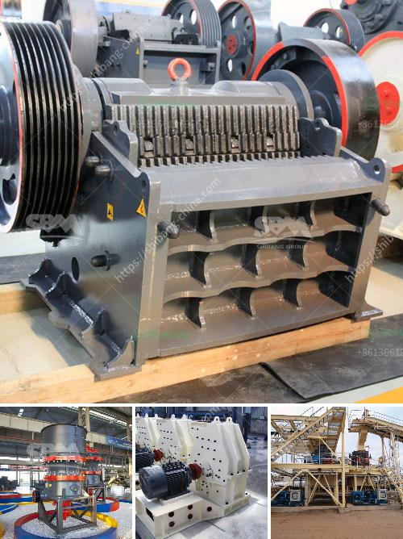

<h3>manufacturers of stone crushers in usa</h3>
Manufacturers of stone crushers in the United States have a wide variety of options to choose from. Our team of experienced engineers and designers have designed these machines with the latest technology and utmost precision to ensure maximum productivity and minimal maintenance costs. Whether you need a primary, secondary, or tertiary crusher, we have got you covered.

The US stone crusher industry is a major contributor to the country's economic growth and development. Many leading manufacturers have taken part in this thriving industry, including names like Caterpillar, Terex, and McLanahan. These brands are renowned for their high-quality and durable machinery that ensures efficient performance even in the most demanding environments.

Caterpillar is a well-established manufacturer in the construction and mining industries worldwide. Their stone crushers are widely used for crushing various materials like stone, gravel, ore, and minerals. Caterpillar crushers are known for their robust construction and impeccable performance. With their advanced hydraulic systems and high power engines, these crushers can easily handle large volumes of material and deliver consistent output.

Terex, another prominent manufacturer of stone crushers, offers a versatile range of machines suitable for different applications. Their crushers are designed to minimize downtime and increase productivity. Terex crushers are equipped with intelligent electronic control systems that provide precise and reliable operation. They are also known for their low operating costs, making them an ideal choice for various industries.

McLanahan is a trusted name when it comes to stone crushers in the USA. Their machines are known for their innovative designs and exceptional performance. McLanahan crushers ensure consistent size reduction, reliability, and ease of maintenance. They offer a wide range of crushers, including jaw crushers, impact crushers, cone crushers, and hammer crushers, catering to diverse material processing requirements.

In addition to these leading manufacturers, there are also many local manufacturers in the United States that provide reliable stone crushers. These manufacturers cater to the specific needs of customers in different regions and industries. Their machines are known for their durability, cost-effectiveness, and high performance. Working closely with local manufacturers can also provide customized solutions tailored to specific requirements.

To ensure quality and reliability, it is recommended to choose stone crushers from reputable manufacturers who adhere to strict quality control standards. The manufacturer's track record, industry reputation, and customer reviews can provide valuable insights into their product's quality. Additionally, manufacturers that offer excellent after-sales service, including spare parts availability and technical support, can significantly enhance the overall ownership experience.

In conclusion, the United States has a vibrant market for stone crushers, with numerous manufacturers offering a wide range of options. Whether it is for construction, mining, or other industrial applications, these machines play a crucial role in efficient material processing. By choosing a reputed manufacturer with proven expertise in the industry, customers can ensure reliable performance, durability, and cost-effectiveness.
<h3>Contact us</h3><ul><li><strong>Whatsapp:&nbsp;<a href="https://wa.me/8613661969651">+8613661969651</a></strong></li><li><a href="https://swt.shibang-china.com/?git&amp;zhl&amp;manufacturers of stone crushers in usa"><strong>Online Service(chat now)</strong></a></li></ul><h3>Related</h3><ul><li><a href='feldspar stone crusher.md'>feldspar stone crusher</a></li><li><a href='portable concrete crushers.md'>portable concrete crushers</a></li><li><a href='cement plant for sale.md'>cement plant for sale</a></li><li><a href='jaw crusher 24x36.md'>jaw crusher 24x36</a></li><li><a href='hp 500 cone crusher parts.md'>hp 500 cone crusher parts</a></li></ul>