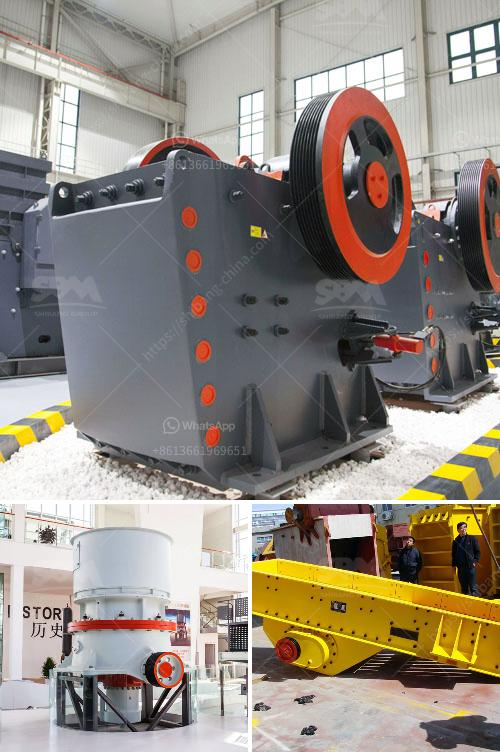

<h3>manufacturers small concrete brokmachine bangkok</h3>
Bangkok, the vibrant and bustling capital city of Thailand, is home to numerous manufacturers specializing in the production of small concrete brick machines. These machines have become an essential tool for construction companies, contractors, and even DIY enthusiasts due to their efficiency and cost-effectiveness in producing high-quality concrete bricks.

One of the leading manufacturers of small concrete brick machines in Bangkok is XYZ Brick Machine Co. With decades of experience in the industry, XYZ Brick Machine Co. has earned a reputation for delivering top-notch machines that cater to the specific needs of their clients. Their products are known for their durability, long lifespan, and user-friendly features.

The small concrete brick machines produced by XYZ Brick Machine Co. are designed to be compact and easy to operate. These machines are suitable for both small-scale residential projects and larger commercial ventures. They can produce a variety of concrete bricks, ranging from standard paving blocks to interlocking bricks with intricate designs.

One of the key advantages of using small concrete brick machines is their ability to significantly reduce labor costs. Traditionally, producing concrete bricks required a considerable amount of manual labor. However, with the introduction of small concrete brick machines, the process has become much faster and more efficient. These machines can produce a high volume of bricks in a short span of time, reducing the need for additional labor.

Additionally, small concrete brick machines offer cost savings in terms of materials. These machines are designed to use a precise amount of cement, sand, and water, minimizing waste and ensuring optimal utilization of resources. This not only reduces material costs but also contributes to a more sustainable construction process.

Furthermore, the small concrete brick machines manufactured in Bangkok are known for their exceptional quality. These machines are equipped with advanced technology and undergo rigorous quality control measures to ensure their reliability and longevity. Manufacturers in Bangkok prioritize providing their clients with machines that can withstand the demanding requirements of the construction industry.

Manufacturers also provide comprehensive after-sales support, including maintenance, servicing, and spare parts availability. This ensures that the small concrete brick machines continue to operate at their full potential, maximizing their lifespan and minimizing downtime.

In conclusion, manufacturers in Bangkok have emerged as leaders in producing small concrete brick machines that cater to the needs of the construction industry. These machines offer numerous advantages, including cost savings, increased efficiency, and exceptional quality. With their compact design and user-friendly features, they have become indispensable tools for construction companies, contractors, and DIY enthusiasts alike. As the demand for durable and sustainable construction materials grows, the small concrete brick machines manufactured in Bangkok have become a crucial component of the industry's success.
<h3>Contact us</h3><ul><li><strong>Whatsapp:&nbsp;<a href="https://wa.me/8613661969651">+8613661969651</a></strong></li><li><a href="https://swt.shibang-china.com/?git&amp;zhl&amp;manufacturers small concrete brokmachine bangkok"><strong>Online Service(chat now)</strong></a></li></ul><h3>Related</h3><ul><li><a href='process for chromium separation from chromite ore.md'>process for chromium separation from chromite ore</a></li><li><a href='vertical mills nigeria ball mill catalog.md'>vertical mills nigeria ball mill catalog</a></li><li><a href='used track mounted stone crusher.md'>used track mounted stone crusher</a></li><li><a href='labratory hammer mill.md'>labratory hammer mill</a></li><li><a href='small scale gypsum powder plant.md'>small scale gypsum powder plant</a></li></ul>