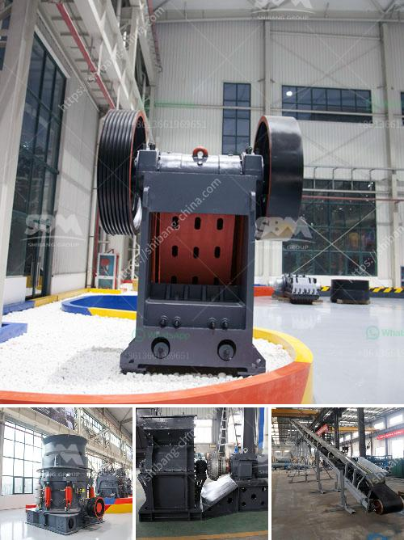

<h3>manufactures crushing machines in bolivia</h3>
Bolivia, a landlocked country in South America, has experienced a significant surge in the manufacturing industry over recent years. Among various sectors, the crushing machine industry has witnessed remarkable growth, becoming a crucial component of the country's industrial development. This article explores how crushing machine manufacturers in Bolivia have played a pivotal role in bolstering the nation's economy.

  Bolivia is endowed with abundant natural resources like minerals and metals, making it a vital player in the global mining industry. Consequently, the demand for efficient and reliable crushing machines has soared in the country. These machines are utilized to break down large rocks and ores into smaller, manageable pieces, facilitating the extraction and processing of valuable resources.

   Bolivia's commitment to infrastructure development has spurred the growth of crushing machine manufacturing. Investment in roads, dams, bridges, and buildings requires the processing of raw materials, necessitating crushing machines to prepare construction materials like aggregates, sand, and gravel. The machine manufacturers in Bolivia have risen to meet this demand, seizing opportunities to contribute to the nation's growing infrastructure needs.

   Crushing machine manufacturers in Bolivia have embraced technology and innovation, integrating advanced features to enhance operational efficiency and productivity. State-of-the-art machines with intelligent control systems, automation, and advanced safety mechanisms are now a staple in the industry. These advancements have not only increased the overall output of crushing machines but also improved worker safety and reduced environmental impact.

   The manufacture of crushing machines in Bolivia has successfully tapped into the global export market. Bolivian manufacturers now compete with established players from around the world. The export of these machines has contributed significantly to the nation's economic growth, generating revenue and creating employment opportunities. Moreover, the success of the crushing machine industry has attracted more foreign investments, further fueling Bolivia's industrial expansion.

    Bolivia, like many nations, has been actively pursuing sustainable development. The crushing machine manufacturers have responded to this by incorporating eco-friendly practices into their operations. Modern machines are designed to minimize dust and noise pollution, utilize energy-efficient technologies, and prioritize recycling and waste reduction. These initiatives align with Bolivia's commitment to environmental conservation and demonstrate the manufacturers' effort to embrace sustainability.

The crushing machine manufacturing industry in Bolivia has emerged as a key player in the country's industrial growth. As demand for raw materials and infrastructure development escalates, these machines provide the crucial backbone for extracting minerals and preparing construction materials. Leveraging technological advancements, innovation, and eco-friendly practices, the manufacturers have not only catered to domestic needs but have also propelled Bolivia into the global export market. The growth of this sector has not only contributed to the country's economic development but also paved the way for sustainable progress, emphasizing the manufacturers' commitment to environmental preservation.
<h3>Contact us</h3><ul><li><strong>Whatsapp:&nbsp;<a href="https://wa.me/8613661969651">+8613661969651</a></strong></li><li><a href="https://swt.shibang-china.com/?git&amp;zhl&amp;manufactures crushing machines in bolivia"><strong>Online Service(chat now)</strong></a></li></ul><h3>Related</h3><ul><li><a href='manganese crusher production line.md'>manganese crusher production line</a></li><li><a href='small gold mining plant in south africa.md'>small gold mining plant in south africa</a></li><li><a href='cara pemasangan belt conveyor.md'>cara pemasangan belt conveyor</a></li><li><a href='japan of mobile crushing plant.md'>japan of mobile crushing plant</a></li><li><a href='ball mill manufacturers gypsum.md'>ball mill manufacturers gypsum</a></li></ul>