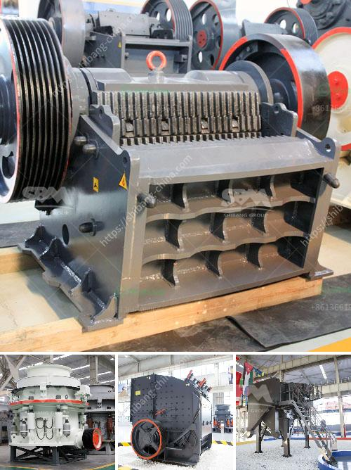

<h3>manufacturing details of talcum powder</h3>
Talcum powder, also known as baby powder, has been a household staple for numerous generations. Its primary purpose is to keep the skin dry and reduce friction, making it ideal for use on babies and adults alike. However, have you ever wondered about the manufacturing details behind this widely used product?

The manufacturing process of talcum powder is relatively straightforward. It typically involves three key steps: mining, purification, and packaging. 

Firstly, talc, the main ingredient in talcum powder, is mined from deposits in various countries. The talc ore undergoes careful extraction methods, ensuring that the highest quality talc is obtained. The mining process involves drilling, blasting, and crushing rocks to release the talc mineral within, transforming it into a powder-like substance.

Once the ore is mined, it goes through a purification process to eliminate impurities. This involves grinding the talc rocks into a fine powder and then treating it to remove any contaminants such as asbestos. The purification step is vital to ensure the safety and purity of the final product.

Finally, the purified talc powder is packaged into consumer-friendly containers such as bottles or cans. Manufacturers often incorporate fragrances or additional ingredients to enhance the experience and appeal of the product. The packaging also includes appropriate labeling and instructions for use.

It is important to note that the manufacturing of talcum powder must adhere to strict quality control measures. Regulatory bodies around the world monitor production processes to ensure compliance with safety standards. This includes thorough testing and analysis to verify the absence of harmful substances, such as asbestos, which has been linked to serious health issues.

In conclusion, the manufacturing of talcum powder involves a series of steps, including mining, purification, and packaging. The use of high-quality talc and adherence to rigorous quality control measures ensure that consumers receive a safe and reliable product. So next time you use talcum powder, you can appreciate the manufacturing efforts that go into creating this everyday essential.
<h3>Contact us</h3><ul><li><strong>Whatsapp:&nbsp;<a href="https://wa.me/8613661969651">+8613661969651</a></strong></li><li><a href="https://swt.shibang-china.com/?git&amp;zhl&amp;manufacturing details of talcum powder"><strong>Online Service(chat now)</strong></a></li></ul><h3>Related</h3><ul><li><a href='pebble crusher for grinding mill.md'>pebble crusher for grinding mill</a></li><li><a href='companies of panama conveyor belts.md'>companies of panama conveyor belts</a></li><li><a href='small stone crushers.md'>small stone crushers</a></li><li><a href='gypsum granules plant manufacturer in india.md'>gypsum granules plant manufacturer in india</a></li><li><a href='principle of impact crusher.md'>principle of impact crusher</a></li></ul>