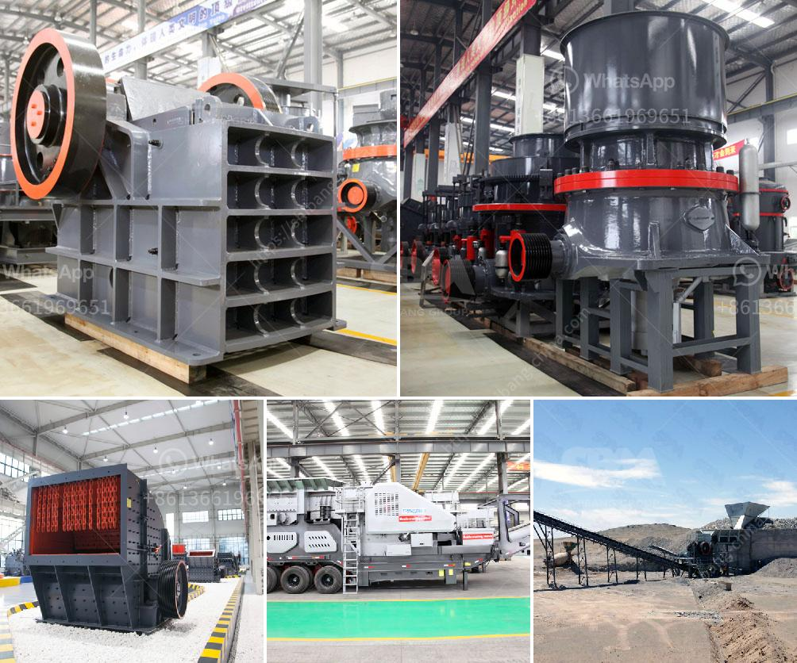

<h3>manufacturing process process calcium carbonate</h3>
Calcium carbonate is a widely used industrial mineral known for its versatility and affordability. It is commonly used in the manufacturing of various products, including plastics, rubber, paints, coatings, adhesives, and paper. The production process of calcium carbonate involves several steps, each of which contributes to its high quality and suitability for various applications.

The first step in the manufacturing process is the extraction of limestone. This is accomplished through mining, where explosives and heavy machinery are used to break down the limestone into manageable chunks. Once the limestone is extracted, it is transported to a crushing plant where it is crushed into small particles. The crushed limestone is then stored in silos for further processing.

The next step in the manufacturing process is the grinding of calcium carbonate. Typically, calcium carbonate is a white powder that needs to be refined to a more processable form. To achieve this, the crushed limestone is further processed in grinding mills to produce a fine powder. The grinding process also improves the chemical and physical properties of the calcium carbonate, making it suitable for a wide range of applications.

After the grinding process, the calcium carbonate powder undergoes a classification process. This involves separating the fine particles from the larger ones. The powder is usually classified using air classifiers or vibrating screens, which separate the particles based on their size. This ensures that the final product has a consistent particle size distribution, which is crucial for achieving the desired performance in different applications.

The next step in the manufacturing process is the modification of calcium carbonate. Depending on the desired properties of the final product, various additives may be added to the calcium carbonate powder. These additives can include dispersants, processing aids, surface modifiers, and other chemicals. The modification process improves the handling, dispersibility, and compatibility of calcium carbonate in different applications.

Once the modification process is complete, the calcium carbonate powder is then packed into bags or bulk containers for distribution. The packaging process ensures that the powder remains free-flowing and does not clump together, which can affect its handling and performance.

It is worth mentioning that the manufacturing process of calcium carbonate can vary depending on the specific requirements of different industries. For example, the pharmaceutical industry may have stricter quality control measures compared to the construction industry. Therefore, the production processes for calcium carbonate are highly customizable to meet the specific needs of different applications.

In conclusion, the manufacturing process of calcium carbonate involves several steps, including extraction, crushing, grinding, classification, modification, and packaging. Each step plays a crucial role in producing high-quality calcium carbonate powder suitable for a wide range of applications. The versatility and affordability of calcium carbonate make it an essential mineral for various industries, contributing to the development and progress of modern manufacturing processes.
<h3>Contact us</h3><ul><li><strong>Whatsapp:&nbsp;<a href="https://wa.me/8613661969651">+8613661969651</a></strong></li><li><a href="https://swt.shibang-china.com/?git&amp;zhl&amp;manufacturing process process calcium carbonate"><strong>Online Service(chat now)</strong></a></li></ul><h3>Related</h3><ul><li><a href='hammer mill and ball mill.md'>hammer mill and ball mill</a></li><li><a href='crushers double toggle.md'>crushers double toggle</a></li><li><a href='components of mobile coal processing plant.md'>components of mobile coal processing plant</a></li><li><a href='rotary screen for coal making process.md'>rotary screen for coal making process</a></li><li><a href='mobile stone crusher for sale in philippines.md'>mobile stone crusher for sale in philippines</a></li></ul>