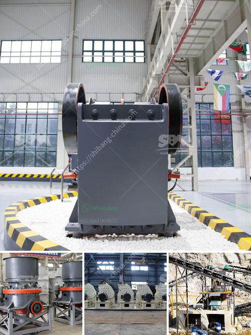

<h3>marble crusher china</h3>
Marble, a metamorphic rock known for its beauty and durability, has been used for centuries for various purposes, including art, architecture, and construction. With its unique veining patterns and stunning colors, marble is highly valued in the world of design. However, the process of extracting and crushing marble can be time-consuming and labor-intensive. That's where the invention of the marble crusher in China comes into play, revolutionizing the industry with its efficiency and effectiveness.

China, known for being at the forefront of technological advancements, has developed and patented a state-of-the-art marble crusher that has set a new benchmark in the field. This innovative machine has revolutionized the process of crushing marble, making it faster, more efficient, and cost-effective.

The first aspect that sets the Chinese marble crusher apart is its advanced technology. Equipped with cutting-edge features and a powerful motor, this crusher is capable of delivering superior crushing performance. Its precise and controlled application of force allows for the efficient breakdown of marble into small, manageable pieces, making the subsequent tasks easier and more efficient. The Chinese marble crusher has changed the game by reducing the need for manual labor and streamlining the overall process.

Another striking feature of the Chinese marble crusher is its versatility. This machine is designed to handle various sizes and types of marble, making it suitable for a wide range of projects. From small decorative items to large construction projects, the Chinese marble crusher can efficiently crush marble of different thicknesses and densities, catering to the diverse needs of the industry. Whether it's a high-end countertop or a beautifully carved sculpture, the versatility of this crusher ensures that every slab of marble can be effectively utilized.

Furthermore, the Chinese marble crusher boasts exceptional durability and longevity. Constructed using high-quality materials and state-of-the-art engineering techniques, this machine is designed to withstand heavy-duty operations and extended usage. Its robust construction minimizes the risk of breakdowns, ensuring uninterrupted crushing processes, and maximizing productivity. The reliability of the Chinese marble crusher has made it a favored choice among businesses involved in marble extraction and processing.

The introduction of the Chinese marble crusher has not only transformed the industry but has also brought about significant economic benefits. This efficient machine has reduced labor costs, as manual crushing has been replaced by automation. The time saved in the crushing process allows for increased production rates, leading to more finished products in a shorter time frame. Additionally, the reduced risk of damage to the marble during crushing minimizes material wastage, further enhancing cost savings for businesses.

In conclusion, the Chinese marble crusher has emerged as a game-changer in the industry, redefining the way marble is crushed and processed. With its advanced technology, versatility, durability, and cost-effectiveness, this machine has become an indispensable tool for businesses involved in marble extraction and processing. As China continues to push the boundaries in technological advancements, the marble crusher is just one example of the nation's commitment to innovation and excellence.
<h3>Contact us</h3><ul><li><strong>Whatsapp:&nbsp;<a href="https://wa.me/8613661969651">+8613661969651</a></strong></li><li><a href="https://swt.shibang-china.com/?git&amp;zhl&amp;marble crusher china"><strong>Online Service(chat now)</strong></a></li></ul><h3>Related</h3><ul><li><a href='river rock crushing equipment.md'>river rock crushing equipment</a></li><li><a href='dealers and manufacturers crusher in europe.md'>dealers and manufacturers crusher in europe</a></li><li><a href='processing of cement.md'>processing of cement</a></li><li><a href='trading industrial stone crushers.md'>trading industrial stone crushers</a></li><li><a href='calcite grinding plant.md'>calcite grinding plant</a></li></ul>