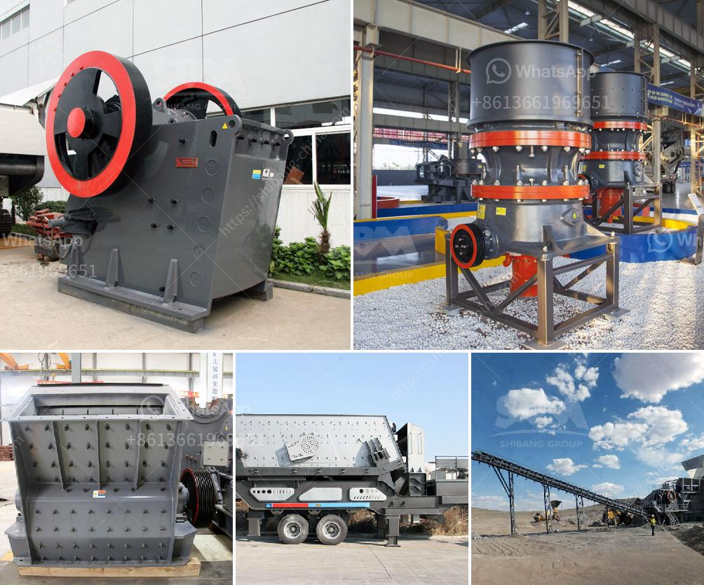

<h3>marble crusher supplier</h3>
Marble is a metamorphic rock known for its beauty and durability. It has been used in construction and sculpture for centuries, and its popularity continues to soar in modern times. However, the process of extracting and shaping marble requires heavy machinery, specifically marble crushers. These machines are essential for mining and processing marble, making a reliable marble crusher supplier crucial for any construction or mining company.

A marble crusher supplier must have experienced and skilled personnel to produce high-quality machinery. They should employ experts in dealing with different types of materials and cater to the varying needs of their clients. A reputable supplier will have a track record of providing efficient and reliable equipment that meets the demands of the industry.

One of the key factors to consider when choosing a marble crusher supplier is their range of products. A supplier with a diverse range of machines can cater to the needs of different projects and industries. Whether it is small-scale mining or larger construction projects, a supplier that offers various types of crushers like jaw crushers, impact crushers, and cone crushers will be able to meet a wide array of requirements.

Another crucial aspect to look for in a marble crusher supplier is their commitment to quality control. The supplier should ensure that their machines are manufactured using the latest technology and adhere to strict quality standards. This includes rigorous testing of the equipment before it is shipped to the clients. A supplier that prioritizes quality control measures will provide their customers with reliable and durable machines that are built to last.

In addition to quality control, a reliable marble crusher supplier should also offer comprehensive after-sales support. This includes technical assistance, spare parts availability, and regular maintenance services. A supplier that goes the extra mile to support their customers after the sale is a clear indication of their commitment to customer satisfaction.

One example of a reputable marble crusher supplier is XYZ Marble Crushers. With over two decades of experience in the industry, XYZ Marble Crushers has established itself as a leading supplier of high-quality marble crushing machinery. Their machines are known for their efficiency, durability, and ease of operation.

XYZ Marble Crushers offers a wide range of crushers, including jaw crushers, impact crushers, and cone crushers, suitable for various mining and construction projects. Their machines are built using advanced technology, ensuring optimal performance and low maintenance requirements.

Moreover, XYZ Marble Crushers provides comprehensive after-sales support, including technical assistance, spare parts availability, and regular maintenance services. Their dedicated team of experts is always ready to assist clients in ensuring the optimal performance of their machinery.

In conclusion, finding a reliable marble crusher supplier is essential for any construction or mining company. A reputable supplier with extensive experience, a diverse range of products, commitment to quality control, and comprehensive after-sales support is crucial for success. XYZ Marble Crushers exemplify these qualities and are recognized as a leading supplier in the industry. By choosing XYZ Marble Crushers, clients can be confident in obtaining high-quality machinery that will meet their specific needs and contribute to the success of their projects.
<h3>Contact us</h3><ul><li><strong>Whatsapp:&nbsp;<a href="https://wa.me/8613661969651">+8613661969651</a></strong></li><li><a href="https://swt.shibang-china.com/?git&amp;zhl&amp;marble crusher supplier"><strong>Online Service(chat now)</strong></a></li></ul><h3>Related</h3><ul><li><a href='germany stone crusher machine factories.md'>germany stone crusher machine factories</a></li><li><a href='ton per hour gold wash plant.md'>ton per hour gold wash plant</a></li><li><a href='latest chrome crush and wash plant for sale in rsa.md'>latest chrome crush and wash plant for sale in rsa</a></li><li><a href='grizzly coal mining equipment.md'>grizzly coal mining equipment</a></li><li><a href='crusher in ethiopia.md'>crusher in ethiopia</a></li></ul>