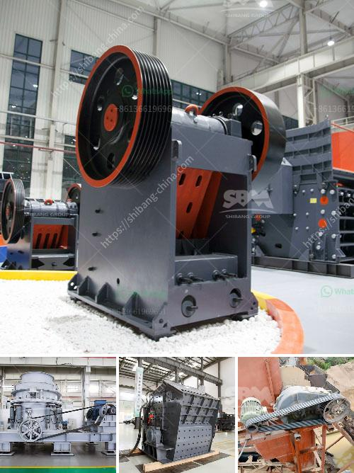

<h3>marble granding machine price in india</h3>
Marble, a naturally occurring stone, has been used for various purposes such as flooring and countertops for thousands of years. With its exquisite beauty and durability, marble has become a popular choice among homeowners and businesses alike. However, the process of grinding and polishing marble surfaces requires specialized equipment, such as marble grinding machines, to achieve the desired finish. In India, the price of marble grinding machines can vary significantly depending on the size, brand, and functionality of the machine.

Marble grinding machines are designed to grind and polish marble floors, countertops, and other marble surfaces. The machine uses rotating diamond abrasive discs to grind and polish the surface in multiple stages, from coarse to fine grit. This process not only removes scratches and stains but also brings out the natural shine and luster of the stone.

In India, there are several manufacturers and suppliers of marble grinding machines catering to the diverse needs of customers. The price of these machines can vary depending on various factors. Firstly, the size of the machine plays a significant role in determining its price. Larger machines with higher horsepower are generally more expensive compared to smaller machines. The size of the machine also determines the area it can cover in a given period, so larger machines are suitable for commercial or industrial applications.

Secondly, the brand and reputation of the manufacturer affect the price of marble grinding machines. Well-established brands with a proven track record of quality and performance tend to have higher-priced machines. These brands invest heavily in research and development to improve the functionality and efficiency of their machines.

Thirdly, the features and functionality of the machine also impact its price. Some machines come with additional features such as adjustable speed settings, automatic water supply for cooling during the grinding process, and dust collection systems. These added features enhance the ease of use and efficiency of the machine, thereby influencing its price.

On average, the price of marble grinding machines in India can range from around INR 20,000 to upwards of INR 50,000, depending on the factors mentioned above. However, it is important to note that this is a rough estimate, and prices can vary significantly depending on the supplier, location, and other factors.

It is advisable for potential buyers to research and compare prices from different suppliers to get a better understanding of the prevailing market rates. Additionally, it is crucial to assess the quality, performance, and after-sales service offered by the manufacturer before making a purchase decision.

In conclusion, marble grinding machines are essential tools for achieving a polished and refined finish on marble surfaces. The price of these machines in India can vary depending on factors such as size, brand, and functionality. It is recommended for buyers to conduct thorough research and compare prices to make an informed decision. By investing in a high-quality marble grinding machine, individuals and businesses can ensure the longevity and beauty of their marble surfaces.
<h3>Contact us</h3><ul><li><strong>Whatsapp:&nbsp;<a href="https://wa.me/8613661969651">+8613661969651</a></strong></li><li><a href="https://swt.shibang-china.com/?git&amp;zhl&amp;marble granding machine price in india"><strong>Online Service(chat now)</strong></a></li></ul><h3>Related</h3><ul><li><a href='vertical mill machine in cement industry.md'>vertical mill machine in cement industry</a></li><li><a href='coal washing process machine price.md'>coal washing process machine price</a></li><li><a href='making of calcium carbonate calcite powder.md'>making of calcium carbonate calcite powder</a></li><li><a href='biggest cone crusher in africa.md'>biggest cone crusher in africa</a></li><li><a href='ball mill material of construction.md'>ball mill material of construction</a></li></ul>