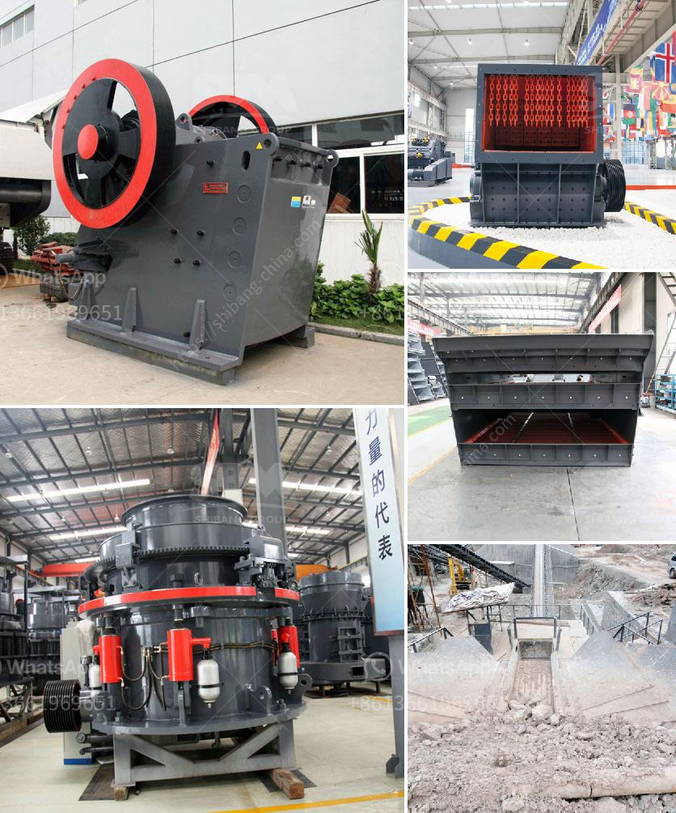

<h3>marble grinding mill</h3>
Marble is a metamorphic rock formed by the original rock in the crust through the action of high temperature and pressure. This process has enormous economic value, which can meet the needs of various industries. Marble has the characteristics of high hardness, high compressive strength, and good physical and chemical properties. Therefore, it has a wide range of applications, such as building materials, decorative materials, papermaking, plastics, rubber, and so on. To meet the market demand for marble powder, marble grinding mills are emerging and are becoming popular.

Among them, the ultra-fine mill equipment is a grinding mill that assists the fine grinding project. It has comprehensive mechanical crushing performance such as rolling, grinding and impact. It can grind various minerals and has a wide range of applications. Its main features are: it can be applied to various non-metallic minerals with a hardness of less than 7 and a Mohs hardness of less than 6; the humidity is less than 6%, which is a grinding equipment that meets the environmental protection requirements; the finished product has high fineness, wide adjustment range, high efficiency and energy saving, and excellent grain shape.

The ultra-fine grinding mill can grind the marble materials into 300-3000 mesh fine powder. This kind of grinding mill has a unique advantage and application value for fine powder grinding and processing. It is an ideal ultra-fine grinding mill for grinding marble powder.

With the development of the powder industry, the market's demand for ultra-fine marble powder continues to increase. The ultra-fine grinding mill has a large market prospect. It uses a highly efficient and energy-saving grinding system and has the advantages of high processing capacity, low energy consumption, and environmental protection. Its performance has been improved through continuous technological innovation and process optimization, meeting the needs of modern processing industries.

Moreover, the ultra-fine grinding mill of marble powder is a highefficiency grinding equipment carefully developed by Guilin Hongcheng combined with the site investigation and customer's actual needs. It has comprehensive mechanical crushing performance such as roll pressing, grinding, and impact. It is an ideal grinding equipment for improving the efficiency of grinding production, which is suitable for grinding projects such as marble, limestone, barite, dolomite, etc.

In conclusion, the marble grinding mill is a new type of high-quality mill with advanced technology, advanced performance, high efficiency, energy saving, environmental protection and high powder quality. It can be used in the fields of rubber, papermaking, pigments, coatings, paints, inks, building materials, medicine, cosmetics, and so on. It provides a strong guarantee for the efficient operation of the project, greatly increasing production capacity and economic benefits. With the continuous advancement of grinding technology, Guilin Hongcheng will continue to improve and innovate, contribute to the progress of the grinding industry, and create value for customers.
<h3>Contact us</h3><ul><li><strong>Whatsapp:&nbsp;<a href="https://wa.me/8613661969651">+8613661969651</a></strong></li><li><a href="https://swt.shibang-china.com/?git&amp;zhl&amp;marble grinding mill"><strong>Online Service(chat now)</strong></a></li></ul><h3>Related</h3><ul><li><a href='gypsum recycling machines for sale.md'>gypsum recycling machines for sale</a></li><li><a href='jaw crusher for sale in malaysia.md'>jaw crusher for sale in malaysia</a></li><li><a href='grinding mill for quartz in india.md'>grinding mill for quartz in india</a></li><li><a href='gypsum board production process.md'>gypsum board production process</a></li><li><a href='china grinding unit.md'>china grinding unit</a></li></ul>