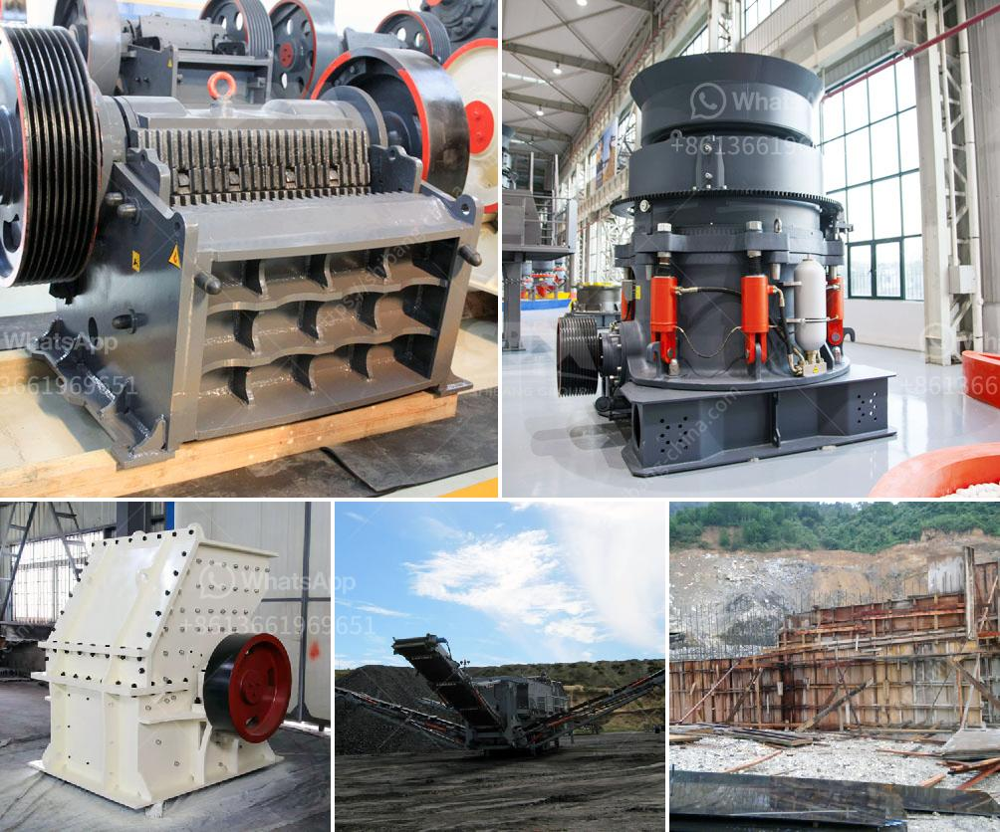

<h3>marble production line germany</h3>
Germany has long been recognized as a global leader in manufacturing and technological advancements. One industry in which Germany has truly excelled is the production of marble. With state-of-the-art machinery, skilled craftsmen, and a commitment to excellence, Germany's marble production line has become synonymous with elegance and quality.

The marble production line in Germany is a sophisticated operation that requires great skill and precision. The marble blocks initially have to undergo various processes. First, the blocks are cut into slabs with a diamond-tipped saw. Then, the slabs are polished to enhance their natural shine. A computer-controlled machine precisely cuts the slabs to the desired size and shape, creating individual marble pieces ready for installation.

Germany's marble production line is also environmentally conscious. The machinery used in the production process is energy efficient, reducing energy consumption and emissions. Additionally, the marble slurry generated during processing is carefully collected and recycled, ensuring minimal waste and environmental impact.

The quality of German marble is unparalleled. German marble is known for its durability, aesthetic appeal, and resistance to staining. The country has an abundance of natural stone resources, allowing for a wide variety of marble types, colors, and patterns to be produced. Some of the most popular German marbles include Carrara, Botticino, and Calacatta.

Beyond its domestic market, Germany is a major exporter of marble. Its production line caters to international demands, supplying marble to various countries around the world. The export industry contributes significantly to Germany's economy, generating revenue and creating employment opportunities.

In conclusion, Germany's marble production line represents the epitome of craftsmanship and technological advancements. The combination of state-of-the-art machinery, skilled labor, and environmental consciousness results in superior quality marble products. With a strong domestic market and a global export industry, Germany continues to solidify its position as a leader in the marble production industry.
<h3>Contact us</h3><ul><li><strong>Whatsapp:&nbsp;<a href="https://wa.me/8613661969651">+8613661969651</a></strong></li><li><a href="https://swt.shibang-china.com/?git&amp;zhl&amp;marble production line germany"><strong>Online Service(chat now)</strong></a></li></ul><h3>Related</h3><ul><li><a href='5 raymond roller mill.md'>5 raymond roller mill</a></li><li><a href='used ball mill in gujrat.md'>used ball mill in gujrat</a></li><li><a href='marble grinding mill.md'>marble grinding mill</a></li><li><a href='jaw crusher structure.md'>jaw crusher structure</a></li><li><a href='stone crusher vibrating screen manila.md'>stone crusher vibrating screen manila</a></li></ul>