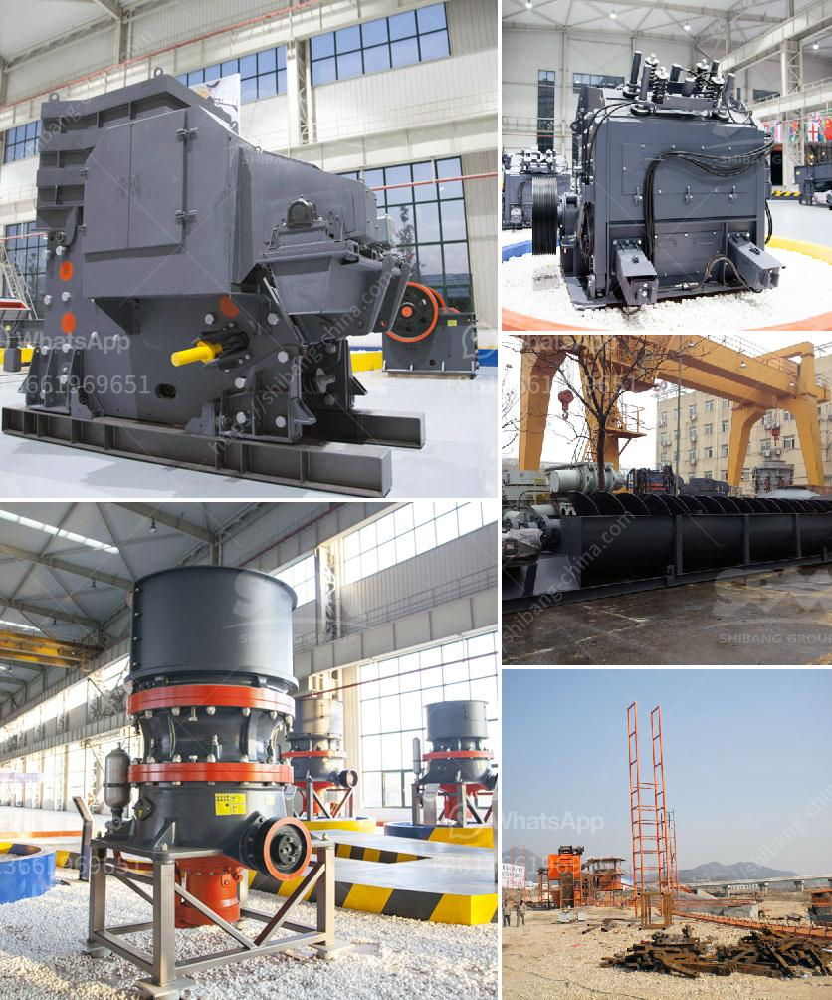

<h3>marble stone powder manufacturer in pakistan</h3>
Marble stone has been used for centuries in various forms, such as pillars, floors, and sculptures, due to its beauty and durability. However, with the advancement of technology, marble stone can now be processed into a fine powder that has numerous applications in the construction industry. As Pakistan is rich in marble stone deposits, the country has seen a surge in marble stone powder manufacturers, who are revolutionizing the construction industry.

One prominent marble stone powder manufacturer in Pakistan is XYZ Marble Industries. With state-of-the-art technology, XYZ Marble Industries has been producing high-quality marble stone powder for several years. The company sources its raw material from the finest marble mines in the country, ensuring the production of superior-quality powder.

Marble stone powder has gained immense popularity due to its various applications in the construction industry. Firstly, it is widely used as a filler in various concrete and cement-based products. Marble stone powder enhances the strength and durability of concrete, making it an ideal choice for construction projects. Moreover, it improves the workability of concrete, ensuring easy application and shaping.

In addition to its use in concrete, marble stone powder is also used in the production of plaster, mortar, and grout. Its fine particles act as binders, enhancing the quality and performance of these materials. The powder helps reduce the shrinkage and cracking of plaster, resulting in a smoother and more sustainable finish. With the incorporation of marble stone powder, mortar and grout exhibit improved adhesion and cohesion properties, ensuring a stronger bond between construction elements.

Furthermore, marble stone powder is also used as an additive in various paints and coatings. Its fine particles act as pigments and fillers, enhancing the aesthetics and durability of the painted surface. Marble stone powder is known for its ability to produce smooth and uniform finishes, making it an excellent choice for high-end architectural coatings.

The marble stone powder industry in Pakistan has witnessed significant growth in recent years, owing to its expanding applications in the construction sector. Not only has it revolutionized the production of concrete, mortar, and plaster, but it has also transformed the way paints and coatings are formulated. With an increasing demand for sustainable and cost-effective construction materials, marble stone powder has emerged as a game-changer in the industry.

Pakistan, being rich in marble stone reserves, has the potential to become a global leader in marble stone powder production. The presence of numerous manufacturers, like XYZ Marble Industries, ensures a steady supply of high-quality powder to cater to both local and international markets. This not only boosts the economy but also creates employment opportunities for the local population.

In conclusion, the marble stone powder industry in Pakistan is revolutionizing the construction industry by offering high-quality, durable, and sustainable materials. With its varied applications in concrete, plaster, mortar, paints, and coatings, marble stone powder has become an essential ingredient in the construction sector. The growth of the industry not only benefits the economy but also contributes to sustainable development by utilizing natural resources effectively. In the coming years, Pakistan has the potential to emerge as a global leader in marble stone powder production, further driving innovation and growth in the construction industry.
<h3>Contact us</h3><ul><li><strong>Whatsapp:&nbsp;<a href="https://wa.me/8613661969651">+8613661969651</a></strong></li><li><a href="https://swt.shibang-china.com/?git&amp;zhl&amp;marble stone powder manufacturer in pakistan"><strong>Online Service(chat now)</strong></a></li></ul><h3>Related</h3><ul><li><a href='machine to make dolomite powder.md'>machine to make dolomite powder</a></li><li><a href='gypsum recycling equipment for sale.md'>gypsum recycling equipment for sale</a></li><li><a href='hammer mill bison price.md'>hammer mill bison price</a></li><li><a href='mining process for perlite.md'>mining process for perlite</a></li><li><a href='used vertical grinding machine.md'>used vertical grinding machine</a></li></ul>