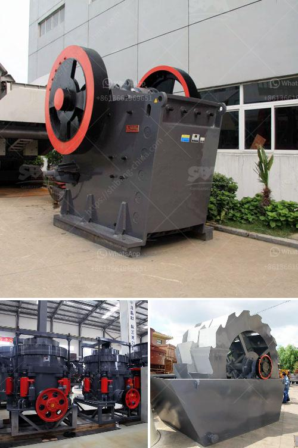

<h3>material engineering previous objective questions</h3>
Material engineering is a branch of engineering that involves the development, research, design, and processing of materials for use in various applications. It encompasses the study of the properties, structure, and performance of materials, as well as the exploration of ways to improve existing materials and develop new ones. In order to assess the knowledge and understanding of material engineering concepts, previous objective questions have been used as a standard evaluation method. Let's take a look back at some of these questions and their significance.

Objective questions are designed to test a student's understanding of specific concepts, theories, and principles related to material engineering. These questions are usually multiple-choice or true/false in nature, providing candidates with a choice of answers to select from. The objective format allows for a quick assessment of a student's knowledge and provides valuable feedback on their understanding of the subject matter.

One common objective question in material engineering asks about the properties of different materials. For example, candidates may be asked to identify which material has the highest tensile strength or which material has the best resistance to corrosion. These questions require a deep understanding of material properties and their applications in real-world scenarios. By answering these questions correctly, candidates demonstrate their ability to apply theoretical knowledge to practical situations.

Another important focus in material engineering objective questions is the processing and manufacturing of materials. Candidates may be asked to identify the correct manufacturing technique for a specific material or to match the material with its suitable processing method. These questions ensure that candidates have a comprehensive understanding of the various techniques used to produce materials with specific properties and characteristics.

Objective questions also play a significant role in assessing a student's knowledge of material structure and characterization techniques. Candidates may be asked to identify the crystal structure of a specific material or to match the correct characterization technique for a given scenario. These questions test a student's ability to analyze and interpret material structures using tools like X-ray diffraction or electron microscopy.

Finally, objective questions in material engineering often cover topics related to material selection and design. Candidates may be asked to choose the most suitable material for a specific application or to identify the design limitations of a particular material. These questions assess a student's ability to evaluate material properties and make informed decisions based on their understanding of application requirements.

Overall, objective questions in material engineering serve as a valuable tool for assessing knowledge and understanding of the subject. They cover a wide range of topics, including material properties, processing techniques, characterization methods, and material selection. By answering these questions correctly, students demonstrate their competency in the field of material engineering and their ability to apply theoretical knowledge to practical situations.

As material engineering continues to evolve and new discoveries are made, objective questions will continue to play a pivotal role in evaluating students' understanding of the subject. It is crucial for aspiring material engineers to thoroughly prepare for these questions, as they serve as a gateway to success in the field.
<h3>Contact us</h3><ul><li><strong>Whatsapp:&nbsp;<a href="https://wa.me/8613661969651">+8613661969651</a></strong></li><li><a href="https://swt.shibang-china.com/?git&amp;zhl&amp;material engineering previous objective questions"><strong>Online Service(chat now)</strong></a></li></ul><h3>Related</h3><ul><li><a href='pe 500 750 jaw crusher price.md'>pe 500 750 jaw crusher price</a></li><li><a href='5 micron grinding mill.md'>5 micron grinding mill</a></li><li><a href='cost of stone crushing machine stone crusher quarry.md'>cost of stone crushing machine stone crusher quarry</a></li><li><a href='conveyor belt manufacturer in china.md'>conveyor belt manufacturer in china</a></li><li><a href='granite milling unit.md'>granite milling unit</a></li></ul>