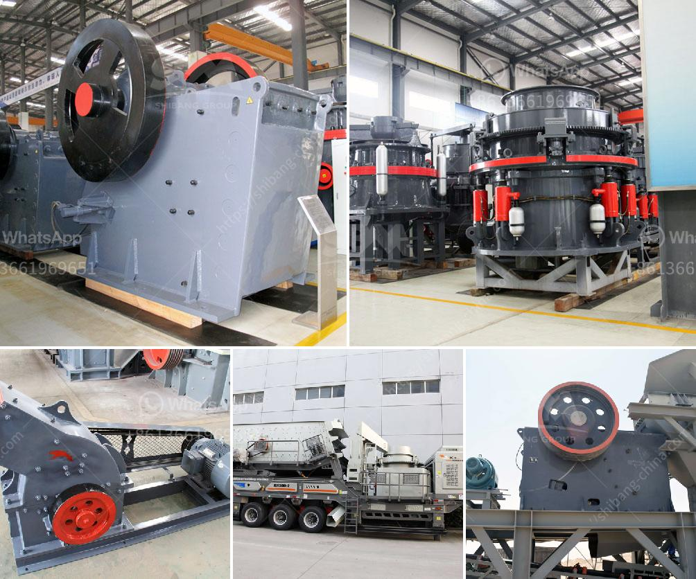

<h3>medium ballast making machine</h3>
Medium ballast making machine is a specialized machine used in the construction of railway tracks. Its main function is to evenly distribute ballast along the tracks, which is crucial in holding the wooden cross ties in place. In recent years, the medium ballast making machine has gained immense popularity due to its efficiency, ease of use, and cost-effectiveness.

The medium ballast making machine is equipped with a conveyor belt that spreads the ballast evenly on the tracks. This eliminates the need for manual labor, which is not only time-consuming but also physically demanding. By automating the process, the machine saves labor costs and increases productivity.

One of the significant advantages of the medium ballast making machine is its ability to achieve precise ballast distribution. The machine is equipped with sensors that detect any irregularities in the track surface. Based on this information, it adjusts the output of ballast accordingly to ensure a uniform distribution along the tracks. This promotes stability and makes the railway tracks safe and reliable.

Moreover, the medium ballast making machine is highly customizable. It can adapt to various track widths and ballast requirements. This versatility makes it suitable for different types of railway projects, including high-speed rail, urban metro, and freight lines. Contractors can easily adjust the settings of the machine to meet specific project needs, thereby streamlining the construction process.

Furthermore, the medium ballast making machine is known for its durability and low maintenance requirements. It is built with robust materials that can withstand harsh working conditions. The components are designed to be easily replaceable if necessary, ensuring minimal downtime and reducing repair costs.

In terms of safety, the medium ballast making machine incorporates various features to protect operators and the surrounding environment. It is equipped with emergency stop buttons, safety guards, and warning signs to prevent accidents and injuries. The machine also adopts advanced technologies to minimize noise pollution and dust emissions, promoting a more eco-friendly construction process.

Lastly, the medium ballast making machine offers long-term cost savings. By automating the ballast distribution process, it reduces the need for manual labor, which can be expensive and time-consuming. Additionally, the machine optimizes the use of ballast, ensuring efficient utilization and minimizing waste. These factors contribute to overall cost reduction and increased profitability for railway construction projects.

In conclusion, the medium ballast making machine is a valuable asset in railway construction. Its ability to evenly distribute ballast, customizable features, durability, safety measures, and cost-effectiveness make it an essential tool for contractors in the industry. With the increasing demand for efficient and reliable railway tracks, this machine continues to play a significant role in the development and maintenance of railway infrastructure worldwide.
<h3>Contact us</h3><ul><li><strong>Whatsapp:&nbsp;<a href="https://wa.me/8613661969651">+8613661969651</a></strong></li><li><a href="https://swt.shibang-china.com/?git&amp;zhl&amp;medium ballast making machine"><strong>Online Service(chat now)</strong></a></li></ul><h3>Related</h3><ul><li><a href='dolomite crusher plant in kuwait.md'>dolomite crusher plant in kuwait</a></li><li><a href='price limestone crusher for sale.md'>price limestone crusher for sale</a></li><li><a href='sand vsi crusher.md'>sand vsi crusher</a></li><li><a href='washing powder production line.md'>washing powder production line</a></li><li><a href='6inch rock crushing mill in guatemala.md'>6inch rock crushing mill in guatemala</a></li></ul>