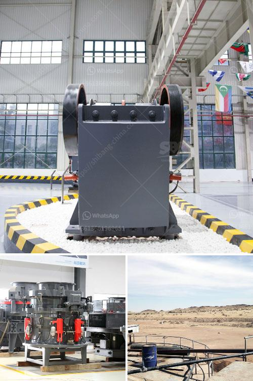

<h3>medium sized stone crusher for sale</h3>
Medium sized stone crusher for sale are used for manufacturing aggregates or crushing hard and abrasive rocks such as limestone, granite, and bauxite. With the rapid development of mining equipment technology, the cone crusher, roller crusher, and impact crusher are greatly improved in terms of performance and durability, ensuring that customers can enjoy quality products and the price they can afford.

The medium-sized stone crusher is our ideal choice because it combines the advantages of many kinds of crushers, such as jaw crusher, hammer crusher, and impact crusher. The crushing chamber is deep and efficient, with high crushing ratio and large capacity. It can crush various materials with compressive strength less than 320 MPa. The structure is simple, and the maintenance is convenient and quick.

One of the most popular medium-sized crushers is the cone crusher, which is widely used in mining, metallurgy, building materials, and chemical industries. The cone crusher has a simple structure, stable performance, low failure rate, and large processing capacity. It is suitable for crushing hard and medium-hard materials, such as limestone, granite, basalt, river pebble, and ore.

The roller crusher is another medium-sized stone crusher for sale. It has a compact structure, reliable performance, low noise, and low energy consumption. The roller crusher is suitable for crushing medium-hard materials such as limestone, slag, coke, coal, and other materials in the industrial sectors of cement, chemical, electric power, and metallurgy.

The impact crusher, also known as the impact crusher, is suitable for crushing medium-hard and brittle materials, such as limestone, coal, calcium carbide, quartz, dolomite, iron ore, and gypsum. It has the advantages of large crushing ratio, high crushing efficiency, and cubic shape of the final product. The impact crusher is widely used in construction, road building, and ore crushing.

When choosing a medium-sized stone crusher for sale, it is necessary to consider the specific requirements of the production line, such as the desired product size, the capacity, and the final product shape. Moreover, the cost and maintenance of the equipment should also be taken into account.

In conclusion, medium-sized stone crushers for sale are essential equipment in aggregates production lines and mining industries. They have the advantages of high crushing efficiency, large capacity, and durability. The cone crusher, roller crusher, and impact crusher are all excellent choices for medium-sized stone crushing. Customers should carefully consider their production requirements and make a reasonable choice based on their needs and budget. With the development of technology, the medium-sized stone crushers will continue to improve in performance and become more cost-effective.
<h3>Contact us</h3><ul><li><strong>Whatsapp:&nbsp;<a href="https://wa.me/8613661969651">+8613661969651</a></strong></li><li><a href="https://swt.shibang-china.com/?git&amp;zhl&amp;medium sized stone crusher for sale"><strong>Online Service(chat now)</strong></a></li></ul><h3>Related</h3><ul><li><a href='standards sizes of conveyor belts.md'>standards sizes of conveyor belts</a></li><li><a href='small scale electric arc ferrochrome smelting.md'>small scale electric arc ferrochrome smelting</a></li><li><a href='used crusher price in uk.md'>used crusher price in uk</a></li><li><a href='low speed crusher suppliers in china.md'>low speed crusher suppliers in china</a></li><li><a href='cone crusher made in italy.md'>cone crusher made in italy</a></li></ul>