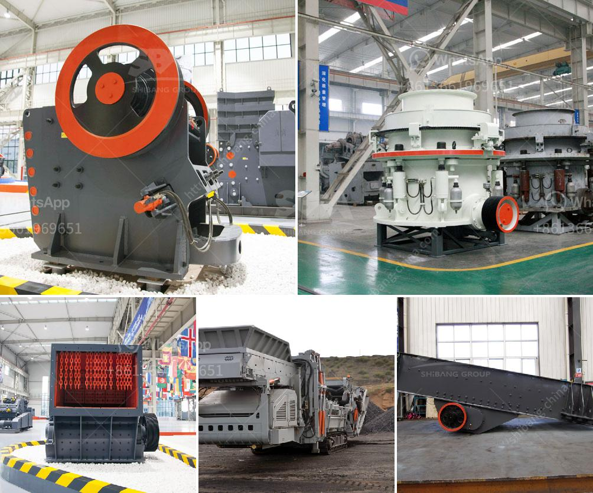

<h3>metals alloys for ball mill</h3>
Metals and alloys play a crucial role in many industrial applications, especially in the field of material science. One such application is the ball mill, which relies on the usage of heavy and hard metallic or alloy balls to crush and grind materials into fine powder.

Ball mills are a type of grinder used to grind and blend materials for use in various industries. They work on the principle of impact and attrition, as balls drop from near the top of the shell. The balls will be lifted and dropped, causing the grinding media to roll and cascade, resulting in the reduction of the size of the material.

When it comes to selecting the right type of material for the balls used in the ball mill, various factors need to be considered, such as the hardness, toughness, and wear resistance. This is where metals and alloys come into play. Common metals used in ball mill application are stainless steel, hardened steel, high carbon steel, and chrome steel.

Stainless steel balls are highly resistant to corrosion and abrasion, making them suitable for applications where the mill is exposed to high corrosive environments. Hardened steel balls, on the other hand, are extremely durable and can withstand heavy impacts, making them ideal for grinding hard materials.

High carbon steel balls are known for their high hardness and excellent wear resistance, enabling them to endure repeated impacts without deforming. Finally, chrome steel balls have high hardness and excellent wear resistance, making them suitable for high-speed and high-load applications.

Moreover, alloys like tungsten carbide or ceramic can also be used for specialized applications. Tungsten carbide balls are extremely hard and wear-resistant, making them suitable for high-temperature and abrasive applications. Ceramic balls, on the other hand, are highly resistant to corrosion and have excellent heat resistance, making them ideal for grinding high-temperature materials.

In conclusion, the selection of the right metal or alloy for the balls used in a ball mill is crucial to ensure optimal performance and durability. Factors like hardness, toughness, and wear resistance are essential considerations while choosing any particular material. By utilizing the suitable metals and alloys, ball mills can efficiently grind and process various materials, facilitating several industrial operations.
<h3>Contact us</h3><ul><li><strong>Whatsapp:&nbsp;<a href="https://wa.me/8613661969651">+8613661969651</a></strong></li><li><a href="https://swt.shibang-china.com/?git&amp;zhl&amp;metals alloys for ball mill"><strong>Online Service(chat now)</strong></a></li></ul><h3>Related</h3><ul><li><a href='crushers double toggle.md'>crushers double toggle</a></li><li><a href='blands of quarry crusher plant ball mill.md'>blands of quarry crusher plant ball mill</a></li><li><a href='pe 400 jaw crusher.md'>pe 400 jaw crusher</a></li><li><a href='chinese mobile crusher.md'>chinese mobile crusher</a></li><li><a href='crawler type mobile crushers.md'>crawler type mobile crushers</a></li></ul>