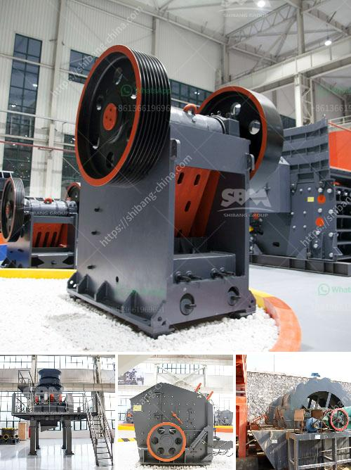

<h3>micro grinding mill</h3>
Micro grinding mill, also known as micro powder grinding mill, ultrafine mill or ultrafine grinding mill, is an efficient and energy-saving grinding mill designed by our company's experts on the basis of advanced milling technology and combining many years of practical experience. It is widely used in the field of metallurgy, building materials, chemical industry, mining, refractories, cement and so on.

One of the outstanding features of micro grinding mill is its fineness. It can achieve ultrafine grinding of various materials with Mohs hardness below 9.3 and humidity below 6%. The fineness can be adjusted between 325-2500 mesh, which is suitable for grinding various non-flammable and explosive materials.

The grinding chamber and the grinding roller of micro grinding mill are made of high-quality materials. Compared with traditional mills, the wear resistance is greatly improved, which can ensure the service life of the equipment. At the same time, the grinding roller and the grinding ring adopt a new design. They have a larger contact area, which can effectively improve the grinding efficiency and output.

Micro grinding mill adopts the advanced electromagnetic vibration feeder, which can evenly and continuously feed the materials into the grinding chamber. The materials are ground and crushed by the grinding roller and the grinding ring, and then the air is blown into the classifier for classification. The qualified fine powder enters the cyclone collector with the airflow, and the discharged powder is purified by the dust collector. The whole process is highly automated, which not only saves manpower, but also ensures the quality of the products.

Micro grinding mill has a wide range of applications. It can process various non-flammable and explosive minerals with a hardness below 9.3 and a moisture content below 6%, such as quartz, feldspar, calcite, limestone, talc, ceramics, marble, granite, dolomite, bauxite, iron ore, barite, bentonite, coal gangue, coal, etc. It can also be used for the grinding and processing of materials such as chemical raw materials, thermal insulation materials, refractory materials, and medicinal materials.

In summary, micro grinding mill is an ideal equipment for ultrafine grinding. It has the advantages of high grinding efficiency, low power consumption, large feed size, easy adjustment of product fineness, simple equipment process, small footprint, low noise, low dust generation, no pollution to the environment, and good sealing. In addition, it also has the advantages of reliable performance, stable operation, convenient maintenance, and long service life. With its excellent performance, micro grinding mill has been widely used in various industries and has become an indispensable grinding equipment in the industrial field.
<h3>Contact us</h3><ul><li><strong>Whatsapp:&nbsp;<a href="https://wa.me/8613661969651">+8613661969651</a></strong></li><li><a href="https://swt.shibang-china.com/?git&amp;zhl&amp;micro grinding mill"><strong>Online Service(chat now)</strong></a></li></ul><h3>Related</h3><ul><li><a href='sand crusher for sale.md'>sand crusher for sale</a></li><li><a href='principle of operation of stone crusher.md'>principle of operation of stone crusher</a></li><li><a href='mining crusher machinery tanzania.md'>mining crusher machinery tanzania</a></li><li><a href='jaw crusher price in saudi.md'>jaw crusher price in saudi</a></li><li><a href='price of mini cement plant india.md'>price of mini cement plant india</a></li></ul>