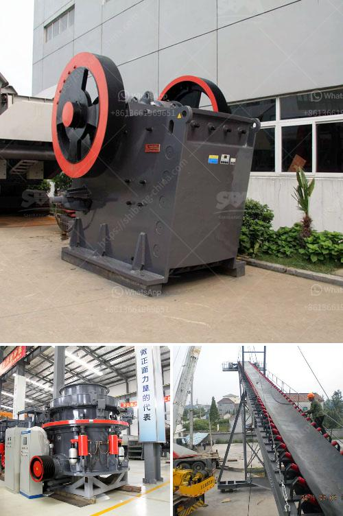

<h3>micro powder grinder mill</h3>
Micro powder grinder mill, also known as superfine mill, is a new type of ultrafine powder making machine launched by machinery in the last decade. It adopts the advanced technology of high pressure grinding roller and multistage grading to produce ultrafine powder with uniform fineness. So what can this machine bring to the industry?

Firstly, compared with traditional grinding equipment, the micro powder grinder mill has a larger processing capacity, making it become a larger-scale industrial equipment. It can grind a variety of materials, such as limestone, gypsum, calcium carbonate, dolomite, potassium feldspar, bentonite, etc., which are all non-explosive and non-flammable materials with Mohs hardness less than 7 and humidity less than 6%. With adjustable fineness, the machine can meet various industry needs.

Secondly, the micro powder grinder mill has a more comprehensive and efficient crushing effect. The use of multistage grading ensures the uniformity of the final product fineness, reducing the phenomenon of excessive grinding. The high-pressure grinding roller exerts sufficient pressure on the grinding material, so that the material is fully pulverized. This not only improves the fineness and yield but also prolongs the service life of the equipment.

Thirdly, the micro powder grinder mill has the advantages of energy saving and environmental protection. The electromagnetic vibration feeder evenly feeds the material, and the main engine works at full load, saving electricity consumption. The sealing device and the pulse dust collector prevent the dust from overflowing, creating a clean and environmentally friendly production environment.

In addition, the micro powder grinder mill has a more intelligent control system. The main machine adopts frequency conversion speed regulation, which is convenient for adjusting the grinding speed according to the actual needs. The analyzer of the machine can automatically adjust the fineness of the finished product, ensuring the accuracy of the finished product and reducing energy consumption.

Furthermore, the micro powder grinder mill has a wide range of applications. It can be used in chemical, construction, metallurgy, mining, refractory, ceramics, cement and other industries. It can not only process non-metallic minerals but also process metal ores. It is a versatile equipment that meets the needs of different industries.

To sum up, the micro powder grinder mill is a new type of ultrafine powder making machine with high efficiency and energy saving. It can grind various non-flammable and non-explosive materials with Mohs hardness below 7 and humidity below 6%, creating value in the powder processing industry. With the development of technology, the micro powder grinder mill will continue to upgrade and bring more benefits to various industries.
<h3>Contact us</h3><ul><li><strong>Whatsapp:&nbsp;<a href="https://wa.me/8613661969651">+8613661969651</a></strong></li><li><a href="https://swt.shibang-china.com/?git&amp;zhl&amp;micro powder grinder mill"><strong>Online Service(chat now)</strong></a></li></ul><h3>Related</h3><ul><li><a href='price of tph stone crusher.md'>price of tph stone crusher</a></li><li><a href='manufacturers small concrete brokmachine bangkok.md'>manufacturers small concrete brokmachine bangkok</a></li><li><a href='best crusher crushing mm coal of feed size mm.md'>best crusher crushing mm coal of feed size mm</a></li><li><a href='mining vibrating screen for sale.md'>mining vibrating screen for sale</a></li><li><a href='coal washing process machine price.md'>coal washing process machine price</a></li></ul>