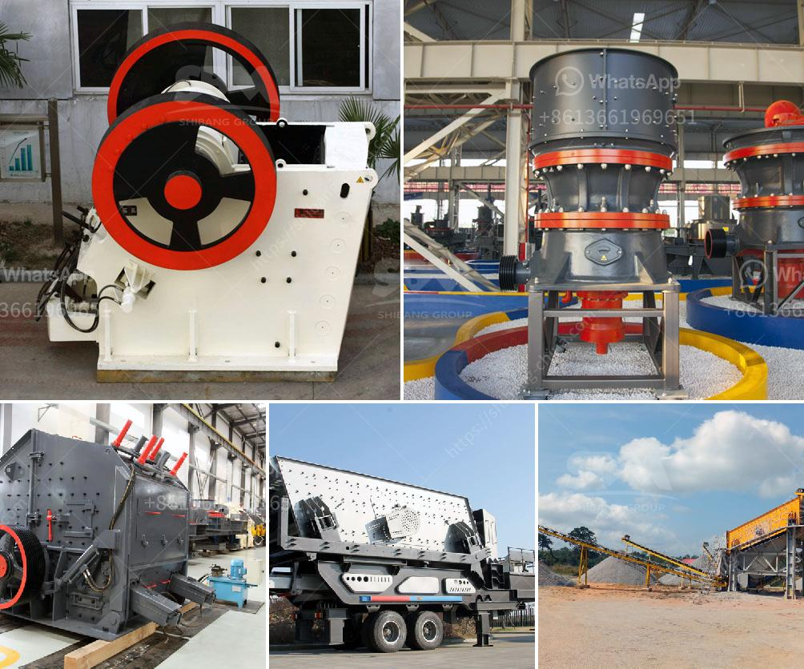

<h3>mill to pulverize stone crusher</h3>
In the field of stone crushing, one often finds enormous boulders and large stones that cannot be effectively handled by traditional crushers. In such situations, a mill to pulverize stone crusher becomes the ultimate solution to reduce the size and make it suitable for various applications.

A mill to pulverize stone crusher operates on the principle of impact and attrition. It consists of a rotor assembly equipped with hammers that strike the feed material against a hard surface, causing it to break into smaller pieces. The size of the final product can be controlled by adjusting the gap between the rotor and the hard surface.

The mill to pulverize stone crusher is a versatile machine that can be used for a wide range of applications. It can be used to crush stones for construction purposes, like railway ballast, road base, concrete aggregate, and others. It can also be used for industrial purposes, such as the production of cement, lime, and other building materials.

One of the key advantages of using a mill to pulverize stone crusher is its ability to produce a uniform and consistent product size. Unlike traditional crushers, which often produce irregularly shaped and unevenly sized particles, the mill ensures a more precise and controlled reduction of the stone.

Furthermore, the mill to pulverize stone crusher offers a high level of efficiency in terms of energy consumption. Its robust construction and high-quality components make it a durable machine that can withstand heavy-duty operations without experiencing significant wear and tear. This translates into lower maintenance costs and a longer lifespan of the equipment.

Another significant advantage of using a mill to pulverize stone crusher is its adaptability to various types of rock and stone. Whether the material is hard, soft, or abrasive, the mill can effectively pulverize it and produce the desired particle size. This makes it an excellent choice for a wide range of applications and industries.

Moreover, the mill to pulverize stone crusher is usually equipped with advanced safety features to ensure the protection of the operators. These may include emergency stop buttons, safety locks, and protective covers to prevent accidents and injuries.

In conclusion, a mill to pulverize stone crusher is an efficient and reliable solution for stone crushing. It offers uniform and consistent product size, high energy efficiency, adaptability to various types of rock and stone, and enhanced safety features. Whether for construction or industrial purposes, this machinery provides an effective and practical solution to efficiently reduce the size of stones and make them suitable for further processing.
<h3>Contact us</h3><ul><li><strong>Whatsapp:&nbsp;<a href="https://wa.me/8613661969651">+8613661969651</a></strong></li><li><a href="https://swt.shibang-china.com/?git&amp;zhl&amp;mill to pulverize stone crusher"><strong>Online Service(chat now)</strong></a></li></ul><h3>Related</h3><ul><li><a href='how to make a talcum powder.md'>how to make a talcum powder</a></li><li><a href='hammer mill crusher type.md'>hammer mill crusher type</a></li><li><a href='dolomite grinding roller mill manufacturers india.md'>dolomite grinding roller mill manufacturers india</a></li><li><a href='cement plant in turkey.md'>cement plant in turkey</a></li><li><a href='how to set up crusher.md'>how to set up crusher</a></li></ul>