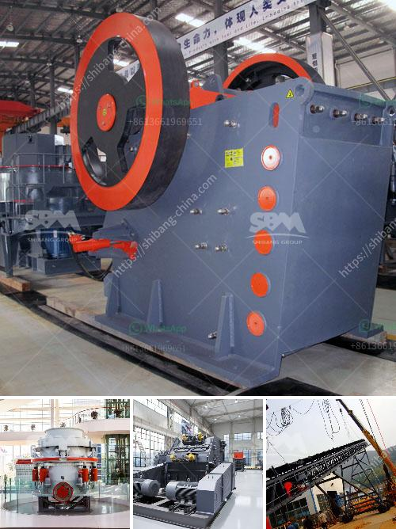

<h3>mineral processing equipment cost</h3>
Mineral processing equipment plays a crucial role in the production of minerals for various industries. These equipment are used to extract, separate, and refine various minerals from their ores. However, the cost of acquiring and operating mineral processing equipment is a significant consideration for mining companies.

There are several factors that determine the cost of mineral processing equipment. One of the primary factors is the size and scale of the operation. Large-scale mining operations require heavy-duty equipment that can handle the processing of large volumes of minerals. These equipment are often more expensive to purchase and maintain compared to smaller-scale operations.

Another factor that affects the cost of mineral processing equipment is the level of automation and technology involved. Advanced equipment with state-of-the-art automation systems can be more costly but offer greater efficiency and productivity. These equipment can streamline the mineral processing process, leading to cost savings in the long run.

The type of mineral being processed also has an impact on the cost of equipment. Some minerals require specialized equipment to extract and refine. For example, precious metals like gold and silver often require specialized extraction methods and equipment, which can be more expensive compared to processing equipment for common minerals like iron ore or coal.

Additionally, the location and accessibility of the mining site can affect the cost of mineral processing equipment. Remote or hard-to-reach locations may require additional logistics and transportation costs, which can increase the overall equipment cost.

Mining companies also need to consider the maintenance and operational costs of mineral processing equipment. Regular maintenance and repairs are necessary to ensure optimal performance and prevent downtime. Companies need to allocate budget for spare parts, ongoing maintenance, and skilled labor to operate and maintain these equipment efficiently.

In conclusion, the cost of mineral processing equipment can vary significantly depending on factors such as the size of the operation, level of automation, type of minerals being processed, location of the mining site, and maintenance requirements. Mining companies need to carefully evaluate these factors to determine the most cost-effective equipment for their mineral processing needs. By making informed decisions, companies can optimize their operations, reduce costs, and maximize their profits.
<h3>Contact us</h3><ul><li><strong>Whatsapp:&nbsp;<a href="https://wa.me/8613661969651">+8613661969651</a></strong></li><li><a href="https://swt.shibang-china.com/?git&amp;zhl&amp;mineral processing equipment cost"><strong>Online Service(chat now)</strong></a></li></ul><h3>Related</h3><ul><li><a href='small scale electric arc ferrochrome smelting.md'>small scale electric arc ferrochrome smelting</a></li><li><a href='ball mill manufacturers in bangalore machinery.md'>ball mill manufacturers in bangalore machinery</a></li><li><a href='gypsum board manufacturing machines prices inindia.md'>gypsum board manufacturing machines prices inindia</a></li><li><a href='used calcite powder plant and machinery.md'>used calcite powder plant and machinery</a></li><li><a href='how to mine limestone small scale.md'>how to mine limestone small scale</a></li></ul>