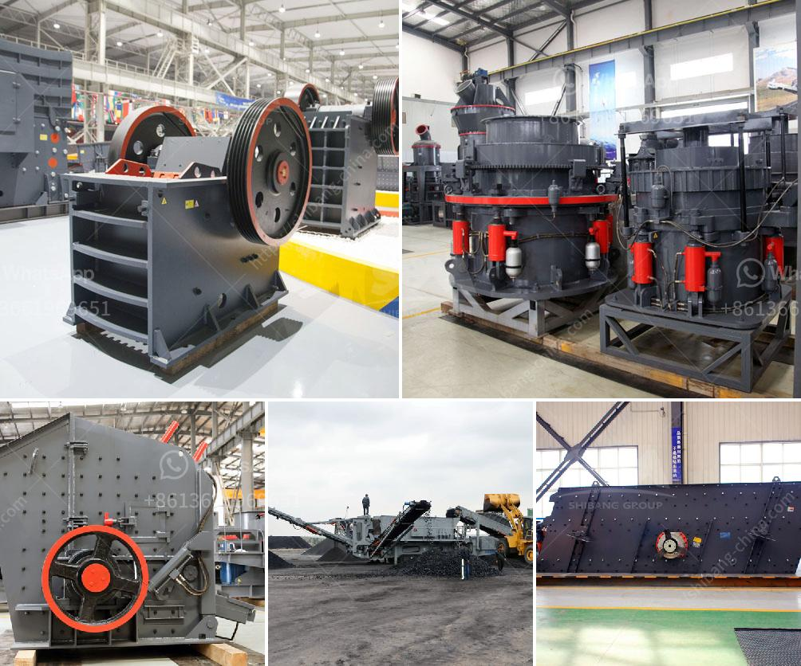

<h3>mineral processing equipment</h3>
Mineral processing equipment plays a crucial role in the success of any mining operation. From the early stages of exploration to the refinement of mined materials, mineral processing equipment is used to extract, separate, and refine the valuable minerals contained within the ore.

The process of mineral extraction commonly involves several stages, including comminution (crushing and grinding), size classification, gravity separation, magnetic separation, and flotation. Each of these processes requires specialized equipment designed to optimize the efficiency of mineral processing operations.

Comminution, the crushing and grinding of ore, is often the first step in mineral processing. This stage is crucial in determining the size and grade of the extracted minerals. Crushers and mills are commonly used in the comminution process to reduce the size of the ore particles. Crushers use mechanical force to break larger rocks into smaller pieces, whereas mills grind the ore into a fine powder using rotating drums.

After the ore has been reduced in size, the next step is size classification. This process involves separating the particles based on their size and density. Screens, classifiers, and cyclones are commonly used for size classification. Screens effectively separate particles based on size, whereas classifiers and cyclones use the principle of gravity to separate particles based on size and density.

Gravity separation is another important process in mineral processing. It is used to separate minerals based on their density differences. Gravity separation equipment, such as jigs, spirals, and shaking tables, utilize the principle of gravity to separate minerals from gangue materials. Jigs are effective in separating heavy minerals from lighter gangue materials, while spirals and shaking tables are used to separate particles based on their specific gravity.

Magnetic separation is primarily used to separate magnetic minerals from non-magnetic minerals. Magnetic separators use magnets to attract and separate magnetic minerals from the ore. This process is widely used in the iron and steel industry, as well as in the recycling of magnetic materials.

Flotation is a crucial process in mineral processing, as it is used to separate valuable minerals from the unwanted gangue materials. In flotation, the ore is mixed with water and chemicals, creating a slurry. Air bubbles are injected into the slurry, which attach to the valuable minerals, allowing them to rise to the surface. Froth collectors and frothers are commonly used in flotation to enhance the efficiency of the process.

To optimize the efficiency of mineral processing operations, specialized equipment is required. Ball mills, crushers, screens, classifiers, jigs, spirals, magnetic separators, and flotation machines are just a few examples of the equipment used in mineral processing. These equipment are designed to handle large volumes of ore and ensure efficient separation of valuable minerals.

In summary, mineral processing equipment plays a vital role in mining operations. It is used to extract, separate, and refine valuable minerals from the ore. Comminution, size classification, gravity separation, magnetic separation, and flotation are the key processes involved in mineral extraction. Specialized equipment is required for each of these processes to ensure efficient and cost-effective mineral processing operations. It is through the use of advanced mineral processing equipment that mining companies are able to extract and produce valuable minerals to meet the demands of various industries.
<h3>Contact us</h3><ul><li><strong>Whatsapp:&nbsp;<a href="https://wa.me/8613661969651">+8613661969651</a></strong></li><li><a href="https://swt.shibang-china.com/?git&amp;zhl&amp;mineral processing equipment"><strong>Online Service(chat now)</strong></a></li></ul><h3>Related</h3><ul><li><a href='vibrating screens 250tph.md'>vibrating screens 250tph</a></li><li><a href='machine for crushing rock.md'>machine for crushing rock</a></li><li><a href='iron ore crusher plant.md'>iron ore crusher plant</a></li><li><a href='samp hammer mill china.md'>samp hammer mill china</a></li><li><a href='ballast quarry crusher machines.md'>ballast quarry crusher machines</a></li></ul>