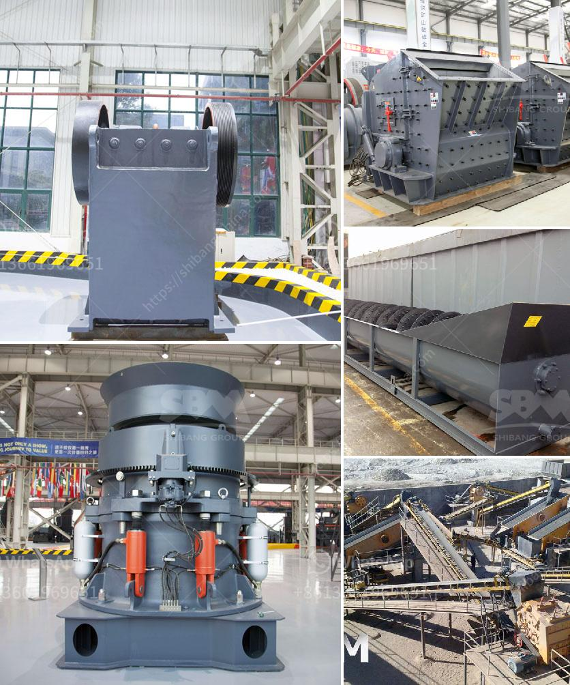

<h3>mini cement plant cost in india</h3>
In India, the cement industry is a prominent sector and plays a crucial role in the country's economic development. However, setting up a cement plant requires considerable resources and investment. Among various options available, a mini cement plant is considered to be a viable choice due to its compact size and cost-effectiveness.

A mini cement plant typically consists of a rotary kiln, preheater, vertical shaft kiln, and other auxiliary equipment. These components undertake different processes like raw material preparation, clinker calcination, cement grinding, and packaging. The cost of setting up such a plant varies depending on a variety of factors like location, size, and production capacity.

The cost of land plays a significant role in determining the total cost of establishing a mini cement plant. The suitable land size must be adequate for housing the various plant components, storage areas, and administrative buildings. Additionally, the proximity of the plant to raw material sources (limestone, clay, etc.) and market demand centers may influence the land cost.

Other major cost components include civil works, machinery, transportation, and installation charges. Civil works involve preparing the site, constructing foundations, and erecting various structures required for the plant. Machinery cost includes the purchase of essential equipment like crushers, mills, conveyors, and other machinery for raw material processing, clinker production, and cement grinding.

The transportation cost involves delivering raw materials and finished products to and from the plant. For a mini cement plant, the transportation radius is usually smaller compared to larger cement plants, minimizing transportation expenses. Installation charges depend on the complexity of the plant design and may include costs for engineering, labor, and equipment installation.

In India, the estimated cost of setting up a mini cement plant ranges from around INR 1,000 crores to INR 1,500 crores. This cost is inclusive of land acquisition, machinery, and equipment, and other auxiliary facilities. However, it is crucial to note that these costs are just estimates and can vary significantly based on several factors.

Despite the initial investment required, a mini cement plant in India offers several advantages. It allows for localized production, reducing transportation costs, and ensuring a steady supply of cement to nearby markets. Additionally, mini cement plants contribute to local employment generation and aid in the development of rural areas.

In conclusion, setting up a mini cement plant in India involves a substantial initial investment. However, considering the long-term benefits and potential returns, it can be a lucrative and sustainable venture. Conducting a thorough feasibility study and analyzing various cost parameters is essential to ensure a successful and cost-effective implementation of a mini cement plant project.
<h3>Contact us</h3><ul><li><strong>Whatsapp:&nbsp;<a href="https://wa.me/8613661969651">+8613661969651</a></strong></li><li><a href="https://swt.shibang-china.com/?git&amp;zhl&amp;mini cement plant cost in india"><strong>Online Service(chat now)</strong></a></li></ul><h3>Related</h3><ul><li><a href='static jaw crusher and plant for sale.md'>static jaw crusher and plant for sale</a></li><li><a href='jaw crusher for sale in ghana.md'>jaw crusher for sale in ghana</a></li><li><a href='japan of mobile crushing plant.md'>japan of mobile crushing plant</a></li><li><a href='mobile crushers qatar.md'>mobile crushers qatar</a></li><li><a href='feldspar powder suppliers.md'>feldspar powder suppliers</a></li></ul>