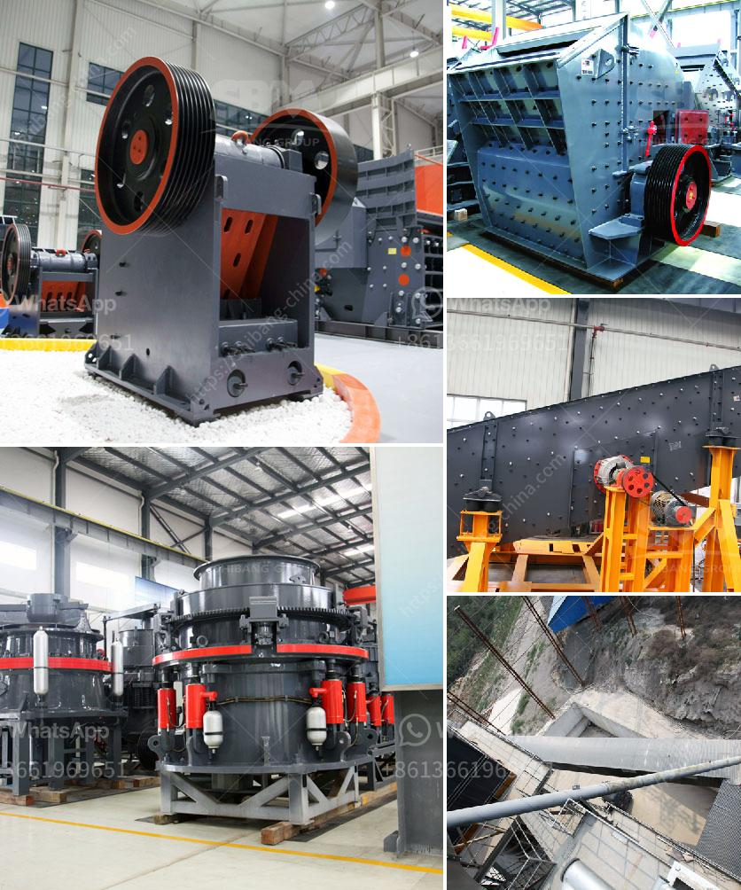

<h3>mini cement plant for sale 500tpd</h3>
The construction industry is at the heart of economic growth, as it is responsible for creating infrastructures essential for various sectors. Cement is a crucial component in the construction process, contributing to the stability and durability of structures. Therefore, the demand for cement is always high, making the establishment of a cement plant a lucrative business opportunity.

For entrepreneurs seeking to enter the cement manufacturing industry, a cost-effective option to consider is a mini cement plant. With a capacity of 500 metric tons per day (tpd), a mini cement plant provides a smaller-scale yet profitable alternative to larger cement plants. A mini cement plant with a 500 tpd capacity allows entrepreneurs to enter the market with limited initial capital investment while meeting the growing demand for cement.

One of the primary advantages of a mini cement plant is its compact size, reducing the space required for operations and making it suitable for small to medium-scale entrepreneurs. Additionally, these plants use advanced technology and equipment to produce high-quality cement, ensuring customer satisfaction and competitiveness in the market.

Purchasing a mini cement plant for sale offers several benefits. Firstly, it provides entrepreneurs with an existing setup including machinery, equipment, and infrastructure, saving time and effort in setting up a plant from scratch. This is particularly attractive for those with limited experience in the industry. Moreover, operating a mini cement plant offers flexibility, enabling entrepreneurs to adapt to changing market conditions and scale up production as the demand increases.

Apart from its profitability, a mini cement plant also has environmental advantages. These plants are designed to optimize energy consumption and minimize waste generation, contributing to sustainable manufacturing practices. By increasing the utilization of alternative fuels and implementing efficient processes, a mini cement plant reduces its carbon footprint, aligning with the global trend towards green and eco-friendly initiatives.

The decision to invest in a mini cement plant should be carefully considered. Detailed research and due diligence are necessary to understand the market, competition, and potential challenges. It is essential to assess the location and availability of raw materials, ensuring a reliable supply chain. Additionally, entrepreneurs should analyze market demand, pricing dynamics, and regulatory requirements to formulate a comprehensive business plan.

Financing options are available for those interested in acquiring a mini cement plant. Financial institutions and private investors recognize the potential profitability of the construction industry and can provide capital for eligible projects. Collaborating with these entities helps entrepreneurs secure the necessary funding to establish and operate a mini cement plant successfully.

In conclusion, a mini cement plant for sale with a 500 tpd capacity offers entrepreneurs an affordable opportunity to enter the cement manufacturing industry. With its compact size, advanced technology, and environmentally-friendly practices, a mini cement plant provides a competitive edge in the market. However, diligent research, a comprehensive business plan, and securing financing are crucial steps to ensure success in this dynamic industry.
<h3>Contact us</h3><ul><li><strong>Whatsapp:&nbsp;<a href="https://wa.me/8613661969651">+8613661969651</a></strong></li><li><a href="https://swt.shibang-china.com/?git&amp;zhl&amp;mini cement plant for sale 500tpd"><strong>Online Service(chat now)</strong></a></li></ul><h3>Related</h3><ul><li><a href='grinding mill cocoa powder plant duyvis.md'>grinding mill cocoa powder plant duyvis</a></li><li><a href='stone crushing machine in china.md'>stone crushing machine in china</a></li><li><a href='stone crusher output per hour india.md'>stone crusher output per hour india</a></li><li><a href='vsi crusher suppliers in europe.md'>vsi crusher suppliers in europe</a></li><li><a href='pe 400 by 600 single toggle jaw crusher specifications.md'>pe 400 by 600 single toggle jaw crusher specifications</a></li></ul>