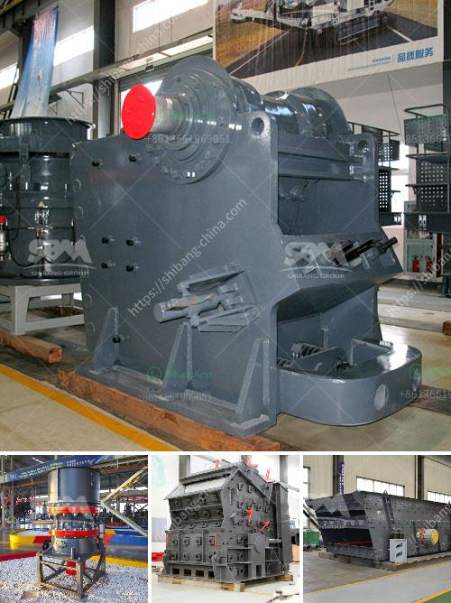

<h3>mini concrete crushers for sale in america</h3>
Mini concrete crushers are becoming increasingly popular in the construction industry. They are primarily used for crushing concrete and other hard materials, but they can also be used for recycling asphalt, gravel, and other materials. These compact and easy-to-use crushers are often mounted on tracks, making them highly maneuverable and efficient.

One of the main advantages of mini concrete crushers is their ability to process small amounts of material at a time. This makes them ideal for small to medium-sized construction projects, such as demolishing old buildings or renovating small spaces. They can easily fit into tight spaces, such as urban areas or residential projects, where larger machinery may not be practical or allowed.

Another benefit of mini concrete crushers is their affordability. Compared to larger crushers, these machines have a lower initial cost and require less maintenance. They are also more fuel-efficient, which can save contractors money in the long run. Additionally, mini crushers can be rented, saving companies the upfront investment of purchasing a crusher outright.

In America, there is a growing demand for mini concrete crushers, driven by the need for sustainable and cost-effective construction solutions. Contractors are realizing the benefits of using mini crushers to recycle waste materials on-site, saving time, money, and reducing the environmental impact.

There are several options available in the market when it comes to mini concrete crushers for sale in America. These machines come in different sizes and specifications, allowing contractors to choose the one that best suits their needs. Some of the leading manufacturers in this field include Komplet, Red Rhino, and Terex.

In summary, mini concrete crushers are a practical choice for construction projects of all sizes. Their compact size, affordable price, and versatility make them an attractive option for contractors in America. As the demand for sustainable and cost-effective construction methods continues to rise, these mini crushers are likely to become even more prevalent in the industry.
<h3>Contact us</h3><ul><li><strong>Whatsapp:&nbsp;<a href="https://wa.me/8613661969651">+8613661969651</a></strong></li><li><a href="https://swt.shibang-china.com/?git&amp;zhl&amp;mini concrete crushers for sale in america"><strong>Online Service(chat now)</strong></a></li></ul><h3>Related</h3><ul><li><a href='grinding mill machine malaysia.md'>grinding mill machine malaysia</a></li><li><a href='river rock crushing equipment.md'>river rock crushing equipment</a></li><li><a href='price crusher price bolivia.md'>price crusher price bolivia</a></li><li><a href='rock crusher mobile machine.md'>rock crusher mobile machine</a></li><li><a href='concrete crusher made in japan.md'>concrete crusher made in japan</a></li></ul>