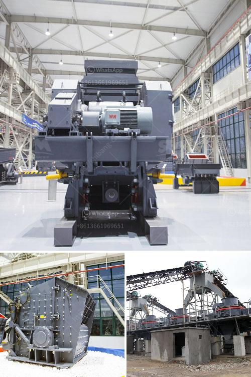

<h3>mini crushing plant for sale</h3>
When it comes to crushing equipment, the key to choosing the right equipment lies in matching up its capabilities with the intended purpose. A miniature crushing plant is one such machine that is designed to handle a specific range of tasks. Like any other type of crushing equipment, a mini crushing plant comes in different models with varying capacities and features. This article will explore the benefits of owning a mini crushing plant and why it is an ideal investment for any business that requires crushing on a smaller scale.

A mini crushing plant is essentially a smaller version of a full-sized crusher machine. This machine can perform the same crushing tasks with equal efficiency but takes up significantly less space. This makes it an excellent choice for businesses with limited space or those working on small projects. Despite its smaller size, a mini crushing plant is built to withstand heavy-duty use and can handle various types of materials such as rock, concrete, asphalt, and more.

One of the main advantages of a mini crushing plant is its portability. Unlike larger crushing plants that are fixed in one location, a mini crushing plant can be easily transported to different job sites. This makes it an excellent choice for construction companies or contractors who frequently move their operations from one site to another. Additionally, a mini crushing plant can be set up and ready to use within a short amount of time, which improves overall productivity.

In terms of costs, a mini crushing plant offers significant savings compared to larger crushing plants. Not only is the initial investment lower, but the operational costs are also reduced. The smaller size of the plant means it requires less power to operate, resulting in lower electricity or fuel costs. Additionally, maintenance costs are generally lower due to the reduced complexity of the equipment. These cost advantages make a mini crushing plant an attractive option for small to medium-sized businesses looking to maximize their budget.

Furthermore, a mini crushing plant is versatile and can be customized to suit specific needs. Manufacturers offer different models of mini crushing plants with varying capacities and features. It is essential to choose a plant that matches the intended application. Whether it is for recycling concrete, crushing rocks for construction projects, or processing asphalt, there is a mini crushing plant available to meet these requirements.

In conclusion, a mini crushing plant is a valuable asset for any business that requires crushing capabilities on a small scale. Its compact size, portability, and cost-effectiveness make it an ideal investment. By selecting the right model with the desired features, businesses can enhance their productivity and save on costs. Whether you are a construction company or a contractor, a mini crushing plant for sale is definitely worth considering as an addition to your equipment fleet.
<h3>Contact us</h3><ul><li><strong>Whatsapp:&nbsp;<a href="https://wa.me/8613661969651">+8613661969651</a></strong></li><li><a href="https://swt.shibang-china.com/?git&amp;zhl&amp;mini crushing plant for sale"><strong>Online Service(chat now)</strong></a></li></ul><h3>Related</h3><ul><li><a href='vertical shaft impact crusher for sale.md'>vertical shaft impact crusher for sale</a></li><li><a href='stone crusher accounting in tally.md'>stone crusher accounting in tally</a></li><li><a href='average cost of graphite mining plant.md'>average cost of graphite mining plant</a></li><li><a href='ball mill grinding and particle.md'>ball mill grinding and particle</a></li><li><a href='impact crusher for iron ore.md'>impact crusher for iron ore</a></li></ul>