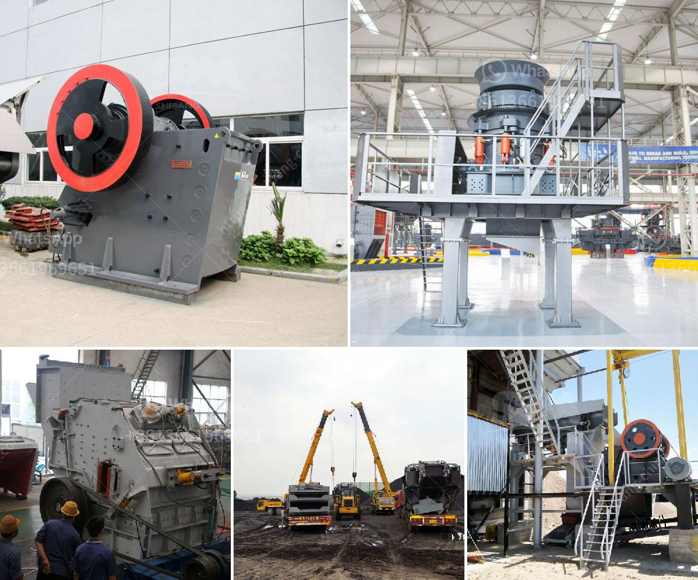

<h3>mini stone crusher price in south africa</h3>
Mini stone crusher has the ability to crush 1-2 or smaller size of hard materials. So it is widely used in mining, metallurgical, construction, road and railway building, and chemistry industries. According to the different requirements of materials, mini stone crusher can produce various types of gravel and sand.

Mini stone crusher price in south africa is based on prices of stone crushers in south africa. The price of stone crusher is easy to fluctuate, so the price of mini stone crusher is also fluctuating.

In recent years, the price of stone crushers in South Africa has been steadily rising, so the choice of mini stone crusher not only reduces the production cost, but also realizes the effect of saving money. It is also the best choice for the majority of users.

The mini stone crusher price in south africa is lower than the traditional crushing equipment, so the cost of production is lower. In particular, the mini stone crusher plays an important role in improving the production efficiency and quality of crushed stone. Therefore, the mini stone crusher industry will usher in a continuous development period in the future.

To meet the requirements of South Africa's investors and be more competitive in the market, mini stone crusher manufacturers will usher in a new round of development opportunities. Stone crushing plant offer many opportunities for investors who want to invest in the stone industry.

Mini stone crusher machine price in south africa is an integral part of the process of stone crushing, but directly affects the efficiency of the entire production line. If the user chooses a less expensive equipment with poor quality, it will not only waste time and effort, but also have an adverse impact on the overall production efficiency.

Therefore, when purchasing a mini stone crusher, the user should have a clear understanding of the production capacity and quality requirements, and choose the appropriate equipment according to their actual needs. Only by doing so, can we maximize the value of the mini stone crusher and bring considerable economic benefits to the user.
<h3>Contact us</h3><ul><li><strong>Whatsapp:&nbsp;<a href="https://wa.me/8613661969651">+8613661969651</a></strong></li><li><a href="https://swt.shibang-china.com/?git&amp;zhl&amp;mini stone crusher price in south africa"><strong>Online Service(chat now)</strong></a></li></ul><h3>Related</h3><ul><li><a href='cost of jaw crusher in kenya.md'>cost of jaw crusher in kenya</a></li><li><a href='hammer mill grinder 10 mm.md'>hammer mill grinder 10 mm</a></li><li><a href='granite quarry machinery for sale.md'>granite quarry machinery for sale</a></li><li><a href='stone crushing plant in saudi.md'>stone crushing plant in saudi</a></li><li><a href='iron ore crusher cost.md'>iron ore crusher cost</a></li></ul>