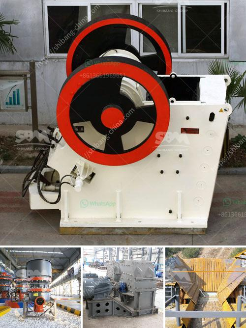

<h3>mining and quarry machines manifactures</h3>
Mining and quarry machines play a crucial role in various industries, such as construction and mining. These machines are specifically designed to extract raw materials from the earth, such as minerals, ores, and stones. Over the years, these machines have become more efficient, diverse, and technologically advanced, enabling the mining and quarrying sector to thrive. In this article, we will explore some of the leading manufacturers of mining and quarry machines.

One of the prominent manufacturers in this industry is Caterpillar Inc. Headquartered in the United States, Caterpillar is known for its wide range of machines that cater to diverse mining and quarrying needs. They offer a comprehensive lineup of equipment, including surface mining machines, underground mining machines, crushing and screening equipment, and material handling solutions. With a commitment to innovation and sustainability, Caterpillar continuously invests in research and development to deliver cutting-edge solutions to its customers.

Another leading manufacturer is Komatsu Ltd., a Japanese multinational corporation. Komatsu specializes in manufacturing construction and mining equipment, including bulldozers, dump trucks, excavators, and wheel loaders. Their machines are renowned for their durability, performance, and fuel efficiency. Komatsu places great importance on customer satisfaction, providing comprehensive after-sales service and support to ensure that their machines operate at optimal levels throughout their lifespan.

Hitachi Construction Machinery Co., Ltd., based in Japan, is also a significant player in the mining and quarrying machine manufacturing industry. Hitachi offers a wide range of products, such as hydraulic excavators, rigid dump trucks, wheel loaders, and more. They are committed to providing solutions that meet the evolving needs of their customers, while focusing on safety, productivity, and environmental sustainability. Hitachi's machines are designed to deliver efficiency and reliability, making them sought after in the mining and quarrying sectors.

Notably, Sandvik AB, a Swedish company, has also established itself as a reliable manufacturer of mining and quarry machines. Sandvik's product portfolio encompasses drill rigs, rock drills, crushers, screens, and breaking equipment. They are committed to sustainable development and have implemented initiatives to minimize environmental impact and promote responsible mining practices. Sandvik's machines are renowned for their quality, performance, and versatility, making them a top choice for customers worldwide.

These manufacturers are just a few examples of the many companies that contribute to the mining and quarrying machine manufacturing industry. Their machines have revolutionized the extraction of raw materials, enabling industries to meet the growing demand for resources. In recent years, there has been a focus on incorporating advanced technologies, such as automation and artificial intelligence, into these machines. This has resulted in increased efficiency, safety, and productivity in mining and quarrying operations.

As the demand for minerals and materials continues to rise, the mining and quarrying sector will rely heavily on advanced machines and equipment. Manufacturers will play a crucial role in meeting these demands by constantly innovating and improving their offerings. With an emphasis on sustainability and responsible mining practices, these manufacturers are set to shape the future of the industry, ensuring the efficient extraction of valuable resources while minimizing environmental impact.
<h3>Contact us</h3><ul><li><strong>Whatsapp:&nbsp;<a href="https://wa.me/8613661969651">+8613661969651</a></strong></li><li><a href="https://swt.shibang-china.com/?git&amp;zhl&amp;mining and quarry machines manifactures"><strong>Online Service(chat now)</strong></a></li></ul><h3>Related</h3><ul><li><a href='fairly used stone crusher for sale nigeria.md'>fairly used stone crusher for sale nigeria</a></li><li><a href='the cost of grinding machine in uganda.md'>the cost of grinding machine in uganda</a></li><li><a href='rock crusher machine equipment in canada.md'>rock crusher machine equipment in canada</a></li><li><a href='used primary crushers for sale.md'>used primary crushers for sale</a></li><li><a href='stone crushing machine manufacturer.md'>stone crushing machine manufacturer</a></li></ul>