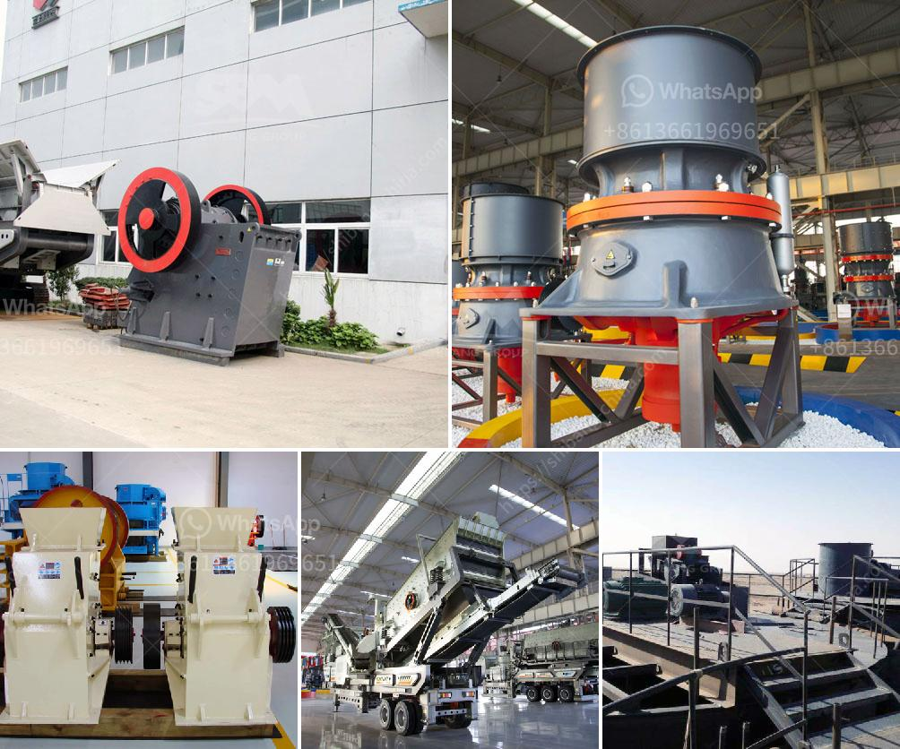

<h3>mining crusher equipment south africa</h3>
South Africa is rich in manganese ore and has more than 100 million tons of storage. The process of selecting ore requires the use of jaw crusher PEX, hydraulic cone crusher, belt feeder, conveyer, hoist and conveyor.

Following the crushing and screening process, manganese ore are mixed with iron ore, carbon, and other materials to form manganese ore particles. These particles are then mixed with water to form a slurry and are sent to the flotation machine for separation.

The crushed manganese ore particles are sent to the grinding machine for further grinding to obtain the final manganese ore powder. These powders are then separated according to particle size and are shipped to different storage tanks, ready for shipment.

In South Africa, manganese is found in the Kalahari Basin in a shallow layer. The area is known for its high-quality manganese ore, which is used in the production of steel and other manganese-based products. Mining companies in South Africa are focused on exploring and extracting these valuable resources.

South Africa's mining industry has a long history, dating back to the 19th century. Today, the country is known as the "world's leader in mining" and is one of the largest producers of gold, diamonds, platinum, and other minerals. The mining sector in South Africa employs over 450,000 workers, making it one of the largest employers in the country.

Mining crusher equipment is used to crush ore materials into smaller particle size for further processing in the mining process. SBM has developed various crushing equipment for mining, such as jaw crusher, impact crusher, cone crusher, etc.

All these mining crusher machines are produced by shanghai SBM, a professional manufacturer and supplier of mining machines. The machines offered by them are all with high quality and competitive price. These crusher machines have different functions, and complete the crushing operation together.

They have been used in the mining industry in South Africa, America, India, Australia and other countries. These machines are suitable for hard rock crushing, such as taconite, granite, dark rock, corundum, quartzite, etc.

Mining crusher machines have more advantages than traditional stone crushers. It reduces the large ore into small particles, and then makes further processing. Jaw crusher machines for sale in India, Jaw crusher machines are most commonly applied in mining, but can also be used in the construction industry as well, as well as many other heavy-duty industrial applications.

In conclusion, mining crusher equipment helps to improve the production efficiency of operators in South Africa, as well as their safety. The machines are designed to be portable, flexible and reliable, so that the operators can carry them easily from one job site to another.

South Africa is rich in mineral resources, making mining an important industry for its economic development. The use of mining crusher equipment can help boost the production efficiency and safety of mining operations in South Africa. With the support of these machines, the mining industry in South Africa will flourish even more in the coming years.
<h3>Contact us</h3><ul><li><strong>Whatsapp:&nbsp;<a href="https://wa.me/8613661969651">+8613661969651</a></strong></li><li><a href="https://swt.shibang-china.com/?git&amp;zhl&amp;mining crusher equipment south africa"><strong>Online Service(chat now)</strong></a></li></ul><h3>Related</h3><ul><li><a href='trackmounted crushing.md'>track-mounted crushing</a></li><li><a href='gypsum board plant cost.md'>gypsum board plant cost</a></li><li><a href='trading industrial stone crushers.md'>trading industrial stone crushers</a></li><li><a href='cost for the ball mill machines.md'>cost for the ball mill machines</a></li><li><a href='stone crushing plant project report doc.md'>stone crushing plant project report doc</a></li></ul>