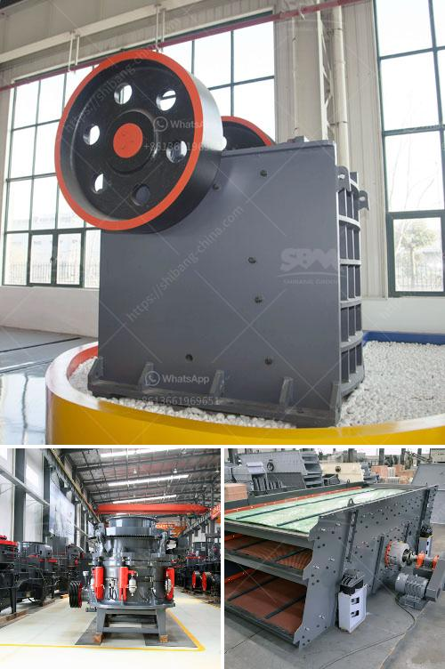

<h3>mining crusher equipment</h3>
Mining crushing equipment is used to break down and compress different types of material, such as stones, rocks, and ore, into smaller, more manageable pieces. Crushing equipment is typically designed to handle a wide range of materials and ensure efficient and reliable performance.

One of the most commonly used types of mining crushing equipment is the jaw crusher. This powerful piece of equipment is designed to handle a variety of materials, including hard rocks and minerals, with a compressive strength of up to 320 MPa. The jaw crusher uses a compressive force to crush the material between a stationary jaw plate and a moving jaw plate, reducing it to smaller sizes.

For larger materials, such as stones and rocks, cone crushers are often used. Cone crushers work by squeezing the material between an eccentrically rotating cone and a stationary cone, which forces the material against a static chamber wall. This action breaks the material into smaller pieces, making it easier to transport and process.

Impact crushers are also widely used in mining operations. These machines use impact force to crush the material, which is fed into a chamber where it is struck by rotating hammers. This impact breaks the material and causes it to be further fragmented by the arrangement of hammers within the chamber.

Mining crusher equipment plays a crucial role in the mining industry, as it allows the extraction of valuable minerals and materials from the earth. These machines reduce the size of materials for easier transportation and processing, and they also enhance the overall efficiency of mining operations.

In addition to their primary crushing function, mining crushers can also be used to produce the desired sized material for specific applications. For example, crushers can be used to produce aggregate for construction purposes or to create finer materials for use in the production of cement or asphalt.

Overall, mining crusher equipment is an essential part of any mining operation. It enables the extraction of valuable minerals and materials from the earth while improving efficiency and reducing costs. With a variety of crushing equipment available, mining companies can select the machine that best suits their needs, ensuring optimal results and productivity.
<h3>Contact us</h3><ul><li><strong>Whatsapp:&nbsp;<a href="https://wa.me/8613661969651">+8613661969651</a></strong></li><li><a href="https://swt.shibang-china.com/?git&amp;zhl&amp;mining crusher equipment"><strong>Online Service(chat now)</strong></a></li></ul><h3>Related</h3><ul><li><a href='machine for crushing rock.md'>machine for crushing rock</a></li><li><a href='marble crusher supplier.md'>marble crusher supplier</a></li><li><a href='zhauns south africa price list pdf.md'>zhauns south africa price list pdf</a></li><li><a href='best crusher crushing mm coal of feed size mm.md'>best crusher crushing mm coal of feed size mm</a></li><li><a href='granite crushers for sale.md'>granite crushers for sale</a></li></ul>