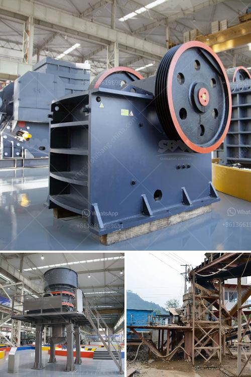

<h3>mining crusher for gold mining</h3>
Mining crusher is a kind of crushing equipment which has a large crushing ratio, high production capacity, stable operation and convenient maintenance. The mining crusher is widely used in mining, metallurgy, building materials, road, railway, water conservancy and chemical industry.

Jaw Crusher: Jaw crusher is ideally suitable for primary crushing. The highest anti-pressure strength of crushed material is 320MPa. It is widely used in mining, metallurgy, construction, highway, railroad, and chemistry industries and etc. Many models are available according to different customer demands.

Impact Crusher: Impact crusher is mainly used in secondary crushing. It can crush various rocks, high efficiency, easy maintenance, and cubic shape of the products. Impact crusher is widely used in mining, highway, and construction.

Cone Crusher: Cone crusher is used for crushing ores and rocks and the advantages are reliable structure, high efficiency, easy adjustment, and economy. There are spring cone crusher and Symons cone crusher. The spring system is the overload protection device, which can make the foreign material go through the machine without bringing any hurt to it. Symons cone crushers are also used in the secondary and tertiary crushing stages.

Gold mining consists of the processes and techniques employed in the removal of gold from the ground. There are several techniques by which gold may be extracted from the Earth. These methods include placer mining, open-pit mining, and underground mining. Depending on the mining project, various mining equipment and processes are used.

One of the main types of mining crusher for gold mining in the mining industry is the jaw crusher. It is used as the primary crusher in the gold crushing process. Jaw crusher is the most widely used gold mining equipment for crushing ore. Jaw crusher can reach the crushing ratio of 4-6 and the shape of final product is even.

So gold jaw crushers are widely applied to crush high hardness, mid hardness and soft rocks and ores such as slags, construction materials, marble, etc. Gold ore gravity separation line. Gold ore gravity separation line is composed of jaw crusher, feeder, high efficiency ball mill, classifier, chute and shaker; while floatation separation line is composed of jaw crusher, cone crusher, circular vibrating screen, ball mill, classifier, flotation machine, concentrator, dryer and so on.

In addition to the broken link mining, ore milling is also a very important aspect, known as the South African gold mines are ultimately to the state of molding powder, as well as lead powder and coal, etc., should become such minerals powder, you need to mill, and generally the most commonly used is the ball mill.

What is a mining crusher? Mining crusher machinery is configured to break down very hard material, such as stone, into small rocks, gravel, or stone powder. Mining crusher machines are used to reduce raw material, such as mined ore, which are extremely hard to break down. PRIMARY CRUSHERS    Jaw and Gyratory crushers are two most important types of primary crushers but sometimes impact crushers are also used if the stone or ore is soft. SECONDARY AND TERTIARY CRUSHERS   we need to move the gold mining crusher, such as jaw crusher, impact crusher, etc. and also the ball mill, Raymond mill, etc. In the gold mining plant, it is used to crush stones or rocks with gold into small grain for further processing, and smelting. What Is Gold Mining? Gold mining is the process of mining gold ores from the ground up till the stage where pure gold is extracted (Richiewiki, 2010). The gold ores are usually big and have to be crushed to reduce them to a size of about 12mm diameter before pure gold can be extracted from them. The ore usually has to pass various crushing stages, each reducing the ore to a certain size. Crushing plant layout is of vital importance. Gold-containing rocks are crushed for several reasons. Crushing reduces the physical size of large rocks, exposing more surface area of rock, thus exposing any gold that may be in the rock and increasing the probability of obtaining the gold from the rock by gravity concentration or by leaching with cyanide. There may be several sizes and shapes of gold grains in the rock--round, flat, coarse or tiny. Because of this, several stages of crushing or grinding can be required (WebElements, 2015).

In a mining plant, a mining crusher is required to process the ores that are extracted from underground mines. Mostly the gold obtained through underground mining is loaded onto the transport trucks for transport to the grinding mill. After the crushing process, the crushed gold ore transported by camionneur vibrating feeder tendre to the grinding mill (gold mine ball mill processing ore process). 
<h3>Contact us</h3><ul><li><strong>Whatsapp:&nbsp;<a href="https://wa.me/8613661969651">+8613661969651</a></strong></li><li><a href="https://swt.shibang-china.com/?git&amp;zhl&amp;mining crusher for gold mining"><strong>Online Service(chat now)</strong></a></li></ul><h3>Related</h3><ul><li><a href='calcium calcium carbonate plants calcium.md'>calcium calcium carbonate plants calcium</a></li><li><a href='jual stone crusher second jakarta.md'>jual stone crusher second jakarta</a></li><li><a href='grinding mills ghana.md'>grinding mills ghana</a></li><li><a href='quarry crusher machinery for sale.md'>quarry crusher machinery for sale</a></li><li><a href='limestone micronizer machine limestone micronizer mill.md'>limestone micronizer machine limestone micronizer mill</a></li></ul>