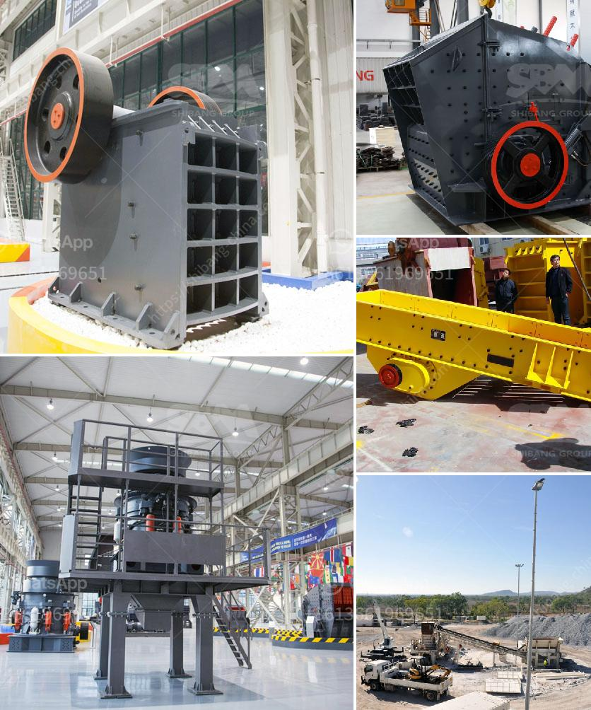

<h3>mining crusher machinery tanzania</h3>
Mining in Tanzania is an important part of the country's economy. With an abundance of valuable minerals, primarily gold and diamonds, Tanzania is the third-largest gold producer in Africa. Mining crusher machinery is used to reduce the size, or change the form, of waste materials so they can be more easily disposed of or recycled, or to reduce the size of a solid mix of raw materials (as in rock ore), so that pieces of different composition can be differentiated.

Crushing is the process of transferring a force amplified by mechanical advantage through a material made of molecules that bond together more strongly, and resist deformation more, than those in the material being crushed do. Crushing devices hold material between two parallel or tangent solid surfaces, and apply sufficient force to bring the surfaces together to generate enough energy within the material being crushed so that its molecules separate from (fracturing), or change alignment in relation to (deformation), each other. The earliest crushers were hand-held stones, where the weight of the stone provided a boost to muscle power, used against a stone anvil.

Today, crushing equipment plays an important role in the mining industry, because it can process large quantities of material to produce the desired product sizes, which are required for efficient mineral extraction and processing. Crushing equipment is also used to break material into smaller pieces to be further processed in the milling and grinding operations. Crushers are available in various styles and configurations, including jaw crushers, impact crushers, cone crushers, and hammer crushers.

In Tanzania, mining crusher machinery is used to crush stones into small particles for various applications. These stone fragments are used for different purposes, such as producing concrete, building roads, or railway tracks. Additionally, mining crusher machinery is used to crush and grind various types of rocks and ores, for example, in the process of gold mining, it crushes gold ores into small particles, so they can be further processed or used for other purposes.

One of the most commonly used crushing equipment in Tanzania's mining industry is the jaw crusher. Jaw crushers are designed to provide the primary crushing capabilities for hard, abrasive materials such as granite, basalt, and other similar minerals. Jaw crushers have a high crushing capacity and efficiency, ensuring high productivity and low operating costs. They are widely used in the mining industry due to their simplicity and reliability.

Another commonly used mining crusher machinery in Tanzania is the impact crusher. Unlike the jaw crusher, the impact crusher is used to crush soft or medium hardness materials, such as limestone, gypsum, and concrete. This type of crusher is commonly used in the construction industry and for the production of aggregates.

In conclusion, mining crusher machinery plays a crucial role in Tanzania's mining industry. It is used to crush and grind different types of rocks and ores to produce the desired product sizes, which are required for efficient mineral extraction and processing. The utilization of advanced crushing equipment, such as jaw crushers and impact crushers, ensures high productivity and low operating costs in Tanzania's mining industry.
<h3>Contact us</h3><ul><li><strong>Whatsapp:&nbsp;<a href="https://wa.me/8613661969651">+8613661969651</a></strong></li><li><a href="https://swt.shibang-china.com/?git&amp;zhl&amp;mining crusher machinery tanzania"><strong>Online Service(chat now)</strong></a></li></ul><h3>Related</h3><ul><li><a href='jaw stone crushers in usa.md'>jaw stone crushers in usa</a></li><li><a href='fdiferentes areas of stone crusher.md'>fdiferentes areas of stone crusher</a></li><li><a href='200 tph rock crusher.md'>200 tph rock crusher</a></li><li><a href='hammer mills used in kenya.md'>hammer mills used in kenya</a></li><li><a href='crusher information cone crusher mine.md'>crusher information cone crusher mine</a></li></ul>