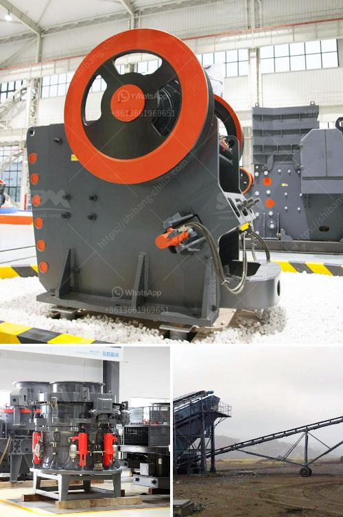

<h3>mining equipments in japan</h3>
In recent years, Japan has witnessed a significant boom in the mining industry, thanks to the implementation of advanced technology and state-of-the-art mining equipment. These developments have propelled the country towards becoming a major player in global mining operations. Let's delve into the thriving mining equipment industry in Japan and explore the impact of these cutting-edge technologies.

Traditionally dependent on imports for mining equipment, Japan has now established itself as a leading developer and manufacturer of mining machinery. The evolution of mining techniques has contributed to this transformation. Japanese companies have focused on improving excavation, drilling, and hauling processes to extract minerals more efficiently, maximizing production output and reducing costs.

The mining equipment industry in Japan is driven by the production of top-of-the-line machinery with exceptional durability, efficiency, and safety features. Japanese manufacturers are renowned for their meticulous attention to detail and commitment to creating mining equipment that meets or exceeds international standards. This dedication to quality has earned them a solid reputation worldwide.

Mining equipment in Japan embodies cutting-edge technologies tailored specifically for the challenges encountered in underground and open-pit mining operations. Companies have invested significantly in research and development to create innovative solutions that improve efficiency and safety. For instance, automation and remote-controlled machinery have reduced the need for human operators in hazardous environments, minimizing the risk of accidents.

Japan has gained particular recognition in the development of Tunnel Boring Machines (TBMs). These massive machines revolutionize the excavation process, enabling the construction of underground tunnels quickly and efficiently. Japanese manufacturers have perfected the technology behind TBMs, enabling them to penetrate various geological formations and create tunnels for various purposes, such as transportation, mining, and infrastructure development.

In tandem with technological advancements, Japanese mining equipment manufacturers have prioritized environmental sustainability. They have incorporated eco-friendly features into their machinery, significantly reducing emissions and minimizing the overall environmental impact of mining operations. Such initiatives align with the global movement towards a greener and more sustainable mining industry.

The Japanese mining equipment industry has also become a successful exporter, supplying high-quality machinery to countries worldwide. Asian and African nations often rely on Japanese manufacturers to meet their mining equipment requirements. Exports of mining machinery have bolstered Japan's economy while contributing to international development initiatives.

The Japanese government has actively supported the growth of the mining equipment industry through various initiatives, including research grants, tax incentives, and partnerships with private companies. This collaborative approach has fostered an environment conducive to the development and adoption of advanced mining machinery. The government's support has played a crucial role in positioning Japan as a global leader in mining equipment.

Japan's mining equipment industry has undergone a remarkable transformation, establishing the nation as a highly innovative and competitive player in the global mining market. By embracing advanced technologies, investing in research and development, and prioritizing environmental sustainability, Japanese manufacturers have created top-quality mining equipment that is both efficient and safe. With continued government support and collaboration, Japan is poised to maintain its strong foothold in the mining equipment industry, further contributing to the nation's economic growth and global influence.
<h3>Contact us</h3><ul><li><strong>Whatsapp:&nbsp;<a href="https://wa.me/8613661969651">+8613661969651</a></strong></li><li><a href="https://swt.shibang-china.com/?git&amp;zhl&amp;mining equipments in japan"><strong>Online Service(chat now)</strong></a></li></ul><h3>Related</h3><ul><li><a href='what is the meaning of 100tph in crusher crusher.md'>what is the meaning of 100tph in crusher crusher</a></li><li><a href='gypsum powder production plants.md'>gypsum powder production plants</a></li><li><a href='manufacture of hammer mill.md'>manufacture of hammer mill</a></li><li><a href='clay brick crusher manufacturers in pakistan.md'>clay brick crusher manufacturers in pakistan</a></li><li><a href='hammer mills for sale in south africa.md'>hammer mills for sale in south africa</a></li></ul>