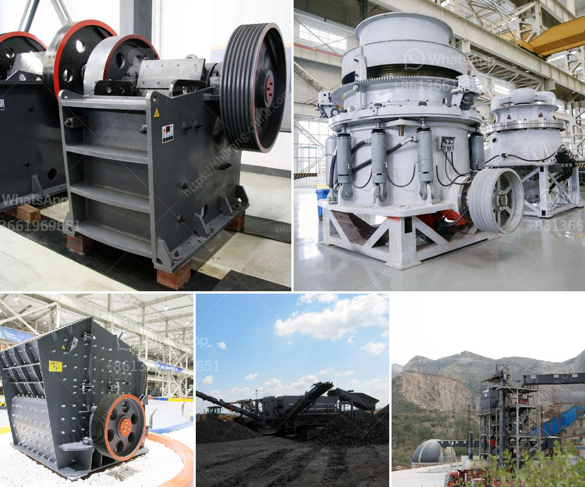

<h3>mining hammer mill suppliers</h3>
In the mining industry, every minute counts. The ability to process large quantities of ore in a short timeframe is crucial to ensure smooth operations and maximize productivity. One vital piece of equipment in the ore processing chain is the mining hammer mill. It is responsible for crushing and grinding up ore, making it ready for further processing.

Mining hammer mill suppliers play a significant role in providing quality products for efficient operations. These suppliers understand the needs and challenges faced by mining companies and strive to deliver reliable solutions that meet or exceed their expectations.

One key factor that sets reputable mining hammer mill suppliers apart is the emphasis on product quality. They understand that downtime due to equipment failure can be extremely costly for mining operations. Therefore, these suppliers source and manufacture hammer mills using high-quality materials and advanced technologies to ensure durability and longevity.

Reliability is another crucial aspect that reputable suppliers prioritize. They understand that mining operations run continuously and cannot afford unexpected shutdowns. As such, they conduct rigorous quality control measures, testing their products extensively before they are shipped to mining sites. This thorough testing helps identify any potential issues and ensures that the hammer mills perform flawlessly under demanding operating conditions.

Moreover, mining hammer mill suppliers offer a range of customized solutions to meet specific requirements. They work closely with mining companies to understand their unique needs and design hammer mills that optimize efficiency and productivity. These customized solutions may include features such as variable speed control, automatic feed mechanisms, and adjustable screen sizes, allowing for precise control over the crushing and grinding process.

Finally, reliable mining hammer mill suppliers also provide excellent after-sales support. They offer comprehensive warranty packages and have a dedicated team of technicians readily available to assist with any technical or maintenance issues that may arise. This commitment to customer service helps mining companies minimize downtime and ensures that their operations remain up and running smoothly.

In conclusion, mining hammer mill suppliers play a vital role in the efficient operation of mining companies. Their commitment to delivering quality products, reliability, customized solutions, and excellent after-sales support contributes significantly to the success of mining operations. By partnering with a reputable supplier, mining companies can ensure that their hammer mills are durable, efficient, and capable of meeting the demanding needs of their operations.
<h3>Contact us</h3><ul><li><strong>Whatsapp:&nbsp;<a href="https://wa.me/8613661969651">+8613661969651</a></strong></li><li><a href="https://swt.shibang-china.com/?git&amp;zhl&amp;mining hammer mill suppliers"><strong>Online Service(chat now)</strong></a></li></ul><h3>Related</h3><ul><li><a href='demand of stage concassage mobile.md'>demand of stage concassage mobile</a></li><li><a href='iron ore processing plant.md'>iron ore processing plant</a></li><li><a href='mobile crusher malaysia.md'>mobile crusher malaysia</a></li><li><a href='technical specification belt conveyors.md'>technical specification belt conveyors</a></li><li><a href='gold mining machine indonesia equipment nigeria.md'>gold mining machine indonesia equipment nigeria</a></li></ul>