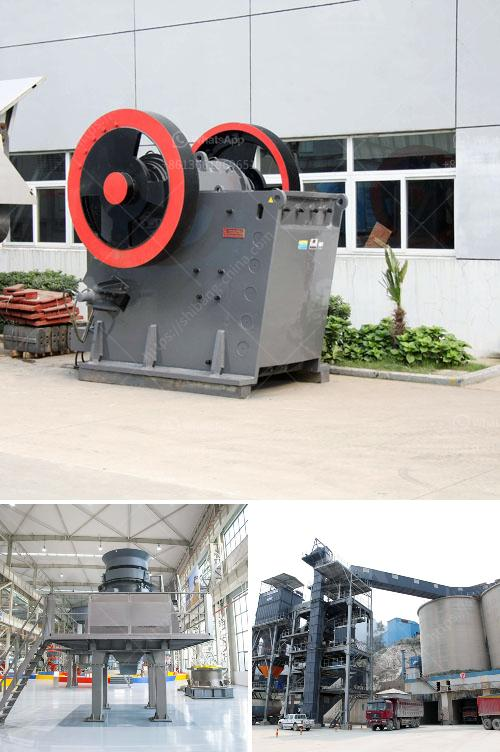

<h3>mining process for perlite</h3>
Perlite is a naturally occurring volcanic glass mineral that is used in a variety of applications, including construction, horticulture, and filtration. In order to obtain this valuable resource, a mining process is required. Let's take a closer look at the process involved in mining perlite.

Perlite deposits are found in volcanic regions where obsidian deposits have weathered over time. These regions, often located near active or dormant volcanoes, are rich in perlite due to the heat and pressure created by volcanic activity. The largest perlite mines can be found in countries like Greece, Turkey, the United States, and China.

The mining process begins with exploration. Geologists study the area to identify potential perlite deposits. This involves analyzing the geographical features, identifying potential volcanic regions, and conducting surveys to determine the quantity and quality of the perlite deposits.

Once a suitable location is identified, the next step in the process is extracting the perlite ore. This is typically done through open-pit mining, which involves the removal of overlying layers of soil, vegetation, and other materials to expose the perlite deposit. Heavy machinery, such as excavators and loaders, are used to remove the materials and create a pit.

Once the perlite deposit is exposed, the extraction process begins. The ore is then drilled, blasted, and loaded onto trucks or conveyor belts for transportation to the processing facility. Care is taken to ensure that the perlite is not contaminated with other minerals or impurities during this process.

At the processing facility, the perlite ore is crushed and milled to reduce the particle size and remove any impurities. This is typically done using jaw crushers and ball mills. The crushed ore is then classified into different grades based on the size and quality of the particles.

After classification, the perlite ore is heated to temperatures of around 900-1100 degrees Celsius. This process is known as "expanding" or "popping" and is the key step in creating the lightweight and porous structure of perlite. The heat causes the water molecules trapped within the perlite to rapidly expand, leading to the characteristic puffed appearance.

Once the perlite has been expanded, it undergoes further processing to ensure optimal quality. This may involve sieving to remove any undersized or oversized particles, as well as additional drying to reduce moisture content. The processed perlite is then packaged and prepared for distribution to various industries.

It's important to note that mining perlite, like any other mining process, can have environmental impacts. The extraction of perlite can result in the disturbance of land, the consumption of energy, and the release of greenhouse gases. However, responsible mining practices, such as reclamation and the use of sustainable energy sources, can mitigate these impacts.

In conclusion, the mining process for perlite involves exploration, extraction, crushing, milling, expanding, and processing. This process transforms the volcanic glass mineral into a valuable resource that can be used in a wide range of applications. By employing responsible mining practices, the environmental impact of perlite mining can be minimized, ensuring the sustainable use of this important mineral resource.
<h3>Contact us</h3><ul><li><strong>Whatsapp:&nbsp;<a href="https://wa.me/8613661969651">+8613661969651</a></strong></li><li><a href="https://swt.shibang-china.com/?git&amp;zhl&amp;mining process for perlite"><strong>Online Service(chat now)</strong></a></li></ul><h3>Related</h3><ul><li><a href='grizzly coal mining equipment.md'>grizzly coal mining equipment</a></li><li><a href='raymond mill crusher price.md'>raymond mill crusher price</a></li><li><a href='stone crusher output per hour india.md'>stone crusher output per hour india</a></li><li><a href='crusher information cone crusher mine.md'>crusher information cone crusher mine</a></li><li><a href='crawler mobile jaw crusher for sale.md'>crawler mobile jaw crusher for sale</a></li></ul>