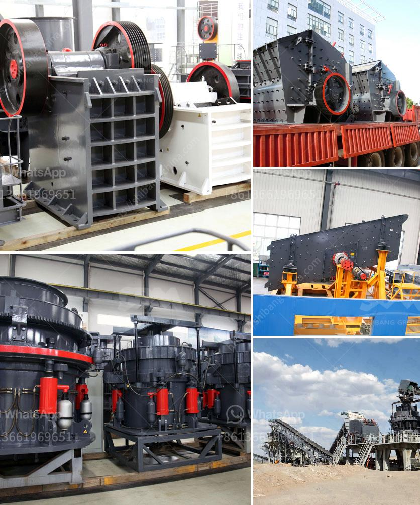

<h3>mining vibrating screen for sale</h3>
Mining vibrating screens are essential equipment in the mining industry to accommodate various types of minerals and materials. With the advancements in technology, the mining industry has significantly grown and improved its efficiency. To keep up with this growth, mining equipment manufacturers have developed and enhanced mining vibrating screens to optimize the productivity and output of mining processes.

A mining vibrating screen is a mechanical device that utilizes vibrating movements to separate and classify different minerals and materials. It plays an important role in the mining industry, as it effectively screens and sieves various types of minerals and materials, such as coal, gravel, sand, minerals, and rocks.

One of the main benefits of a mining vibrating screen is its ability to separate materials into different sizes. This makes it an ideal equipment for a wide range of mining processes, as it allows miners to focus on specific sizes or grades of minerals. By adjusting the screen's inclination angle and vibration parameters, operators can customize the screen to efficiently separate materials and improve productivity.

Another advantage of a mining vibrating screen is its durability and reliability. These screens are built to withstand the harsh mining conditions, including heavy loads, abrasive materials, and high temperatures. Manufacturers use high-quality materials, such as stainless steel, to construct the screens, ensuring their longevity and performance.

When considering the purchase of a mining vibrating screen, several factors should be taken into account. These include the screen size, capacity, and efficiency, as well as the screen's maintenance requirements and cost-effectiveness. Buyers should also consider the reputation and experience of the manufacturer to ensure they are purchasing a reliable and high-quality product.

In conclusion, mining vibrating screens have become an integral part of the mining industry. They provide efficient and reliable screening solutions for a wide range of minerals and materials. With their ability to separate materials into different sizes, mining vibrating screens enhance productivity and improve mining processes. When purchasing a mining vibrating screen, it is important to consider factors such as size, capacity, efficiency, and maintenance requirements to make an informed decision. By investing in a high-quality vibrating screen from a reputable manufacturer, mining companies can optimize their operations and achieve better results.
<h3>Contact us</h3><ul><li><strong>Whatsapp:&nbsp;<a href="https://wa.me/8613661969651">+8613661969651</a></strong></li><li><a href="https://swt.shibang-china.com/?git&amp;zhl&amp;mining vibrating screen for sale"><strong>Online Service(chat now)</strong></a></li></ul><h3>Related</h3><ul><li><a href='price for 100 tph impact crusher.md'>price for 100 tph impact crusher</a></li><li><a href='river stone crusher.md'>river stone crusher</a></li><li><a href='hammer mills for rocks.md'>hammer mills for rocks</a></li><li><a href='grinding mill machine gebraucht.md'>grinding mill machine gebraucht</a></li><li><a href='sand crusher for sale.md'>sand crusher for sale</a></li></ul>