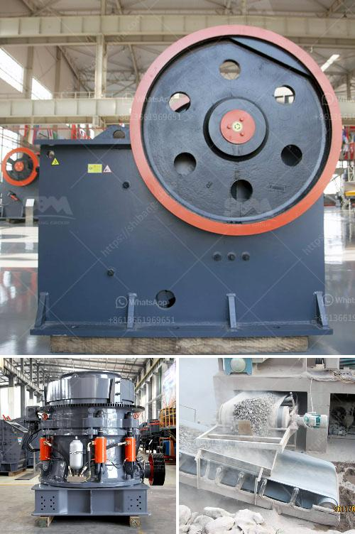

<h3>mobile crusher capacity 200 ton per hour</h3>
In recent years, with the rapid development of the mining industry, the demand for mining equipment is constantly increasing. Mobile crusher plays a vital role in this era, which not only solves the problem of coal mining but also paves the way for future development.

Featuring high efficiency, easy operation, and reliable performance, mobile crusher has become the preferred equipment for coal mining enterprises. The 200 ton per hour mobile crusher is one of the superior crushers among the crushing machines, in terms of both performance and durability. A mobile crusher is able to carry out all the operations that a stationary crusher can do. With the unparalleled advantages of the mobile crusher, it has now become a necessary machine for construction, mining, and many other industries.

The mobile crusher can be combined according to the actual situation of the user, with convenient and flexible mobile, advanced technology, and energy-saving and environmentally friendly production process. It is frequently used in many sites that require mobile crushing.

The mobile crusher is mainly used for materials such as construction waste, river pebble, granite, basalt, limestone, quartz stone, etc., which need to be moved and processed in metallurgy, chemical industry, building materials, highways, railways, hydropower and other industries. Especially for the operation of liquid stone, such as freeway, railway, and hydropower project, it can be moved and processed, and provides more flexible space and reasonable layout configuration.

The mobile crusher can be equipped with different feeders and crushers, such as jaw crusher, impact crusher, cone crusher, hammer crusher, etc. It can be selected according to the needs of the user, so as to meet the different production requirements of the user.

The 200 ton per hour mobile crusher is mainly used for the crushing of construction waste. In addition to this, it also has the functions of screening, sorting, and conveying. Despite its compact size, it is still able to achieve high production capacity with stable performance.

The mobile crusher can also be used in other industries such as metallurgy, chemical engineering, building materials, etc. It is especially suitable for the operation of earthwork engineering, urban infrastructure, and road construction. It can be flexibly coordinated with other equipment to meet different crushing and screening requirements of customers.

In summary, the 200 ton per hour mobile crusher improves the work efficiency and expands the field of deployment. With the development of modern mining industry and technology, mobile crushers with high performance, customizable and flexible configuration will continue to benefit users and make contributions to the future mining industry.

To sum up, mobile crusher can meet the needs of different customers with its advanced technology and convenient operation. It saves time and effort in the mining process and creates higher value for the users. As the development of mining technology, increasingly stringent requirements for mining equipment. Mobile crusher capacity 200 ton per hour should reach 1200 ton per hour to meet the expectation of customers.
<h3>Contact us</h3><ul><li><strong>Whatsapp:&nbsp;<a href="https://wa.me/8613661969651">+8613661969651</a></strong></li><li><a href="https://swt.shibang-china.com/?git&amp;zhl&amp;mobile crusher capacity 200 ton per hour"><strong>Online Service(chat now)</strong></a></li></ul><h3>Related</h3><ul><li><a href='gravel crushing plant.md'>gravel crushing plant</a></li><li><a href='used jaw crushers canada.md'>used jaw crushers canada</a></li><li><a href='raymond mill from china best supplier on sale.md'>raymond mill from china best supplier on sale</a></li><li><a href='used portable rock crusher canada.md'>used portable rock crusher canada</a></li><li><a href='hammer mill in nigeria.md'>hammer mill in nigeria</a></li></ul>