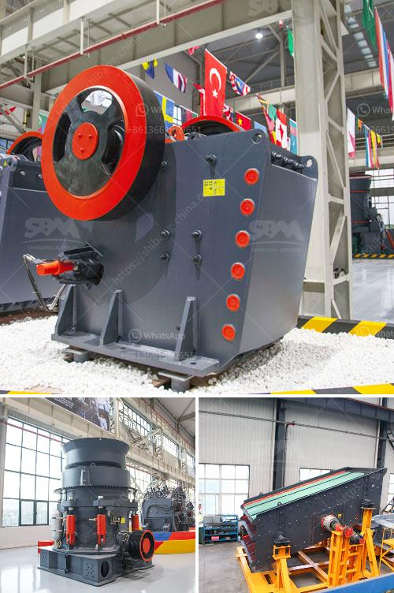

<h3>mobile crusher di malaysia</h3>
Industri konstruksi di Malaysia terus berkembang dengan pesat. Perusahaan konstruksi saat ini menghadapi tantangan yang semakin kompleks dan meningkatnya kebutuhan akan bahan agregat. Untuk memenuhi kebutuhan tersebut, banyak perusahaan konstruksi yang beralih ke penggunaan mobile crusher.

Mobile crusher adalah peralatan penghancur yang dirancang untuk menghancurkan batu, beton, limbah bangunan, dan material konstruksi lainnya menjadi ukuran yang lebih kecil. Perangkat ini dapat dipindahkan dengan mudah dari satu lokasi ke lokasi lain, sehingga sangat cocok untuk pekerjaan konstruksi yang membutuhkan mobilitas tinggi dan efisiensi.

Salah satu keuntungan utama penggunaan mobile crusher adalah kemampuannya untuk mengurangi biaya transportasi material. Sebelum adanya mobile crusher, bahan agregat yang dihasilkan harus diangkut jauh dari lokasi penghancuran ke lokasi konstruksi. Hal ini menghasilkan biaya transportasi yang tinggi. Dengan adanya mobile crusher, material yang dihancurkan dapat digunakan di tempat yang sama atau dekat dengan tempat penghancuran, sehingga mengurangi biaya transportasi secara signifikan.

Selain itu, mobile crusher juga dapat mengurangi dampak lingkungan yang dihasilkan dari pekerjaan konstruksi. Dengan menghancurkan dan mendaur ulang material konstruksi, mobile crusher secara efektif mengurangi limbah konstruksi yang akhirnya akan berakhir di tempat pembuangan sampah.

Mobile crusher di Malaysia telah digunakan secara luas dalam berbagai proyek konstruksi, seperti pembangunan jalan, bangunan komersial, dan perumahan. Kelebihan mobilitasnya memungkinkan perusahaan konstruksi untuk membawa crusher ke lokasi proyek, menghancurkan material yang diperlukan, dan menggunakan hasil hancuran secara langsung dalam pekerjaan konstruksi.

Selain keuntungan yang telah disebutkan, mobile crusher juga memiliki beberapa keunggulan lainnya. Pertama, crusher ini memiliki desain kompak dan dapat dengan mudah dipindahkan melalui jalan raya atau jalur kereta api. Fitur ini memungkinkan perusahaan konstruksi untuk menghemat waktu dan biaya dalam transportasi peralatan dari satu lokasi ke lokasi konstruksi selanjutnya.

Kedua, mobile crusher juga dilengkapi dengan teknologi kontrol yang canggih. Pengguna dapat mengatur ukuran material yang dihasilkan sesuai dengan kebutuhan proyek konstruksi. Dengan melakukan penyesuaian ini, perusahaan konstruksi dapat mengoptimalkan penggunaan material yang dihancurkan dan mengurangi pemborosan.

Dalam industri konstruksi modern, pilihan yang tepat untuk memenuhi kebutuhan agregat adalah dengan menggunakan mobile crusher. Perusahaan konstruksi di Malaysia sudah menyadari manfaat besar yang ditawarkan oleh peralatan ini. Efisiensi, mobilitas tinggi, pengurangan biaya transportasi, dan perlindungan lingkungan adalah beberapa keuntungan utama yang telah ditemukan oleh perusahaan yang menggunakan mobile crusher.

Dengan semakin banyaknya proyek konstruksi yang harus diselesaikan, mobile crusher terbukti menjadi solusi yang ideal bagi perusahaan-perusahaan konstruksi Malaysia. Melalui penggunaan peralatan ini, pekerjaan konstruksi dapat diselesaikan dengan lebih cepat, hemat biaya, dan ramah lingkungan.
<h3>Contact us</h3><ul><li><strong>Whatsapp:&nbsp;<a href="https://wa.me/8613661969651">+8613661969651</a></strong></li><li><a href="https://swt.shibang-china.com/?git&amp;zhl&amp;mobile crusher di malaysia"><strong>Online Service(chat now)</strong></a></li></ul><h3>Related</h3><ul><li><a href='used ball mill machine capacity in indonesia.md'>used ball mill machine capacity in indonesia</a></li><li><a href='pulverizer cursher manufacturer.md'>pulverizer cursher manufacturer</a></li><li><a href='crusher and screening plant.md'>crusher and screening plant</a></li><li><a href='stone crusher plant price list.md'>stone crusher plant price list</a></li><li><a href='jaw crusher maharashtra.md'>jaw crusher maharashtra</a></li></ul>