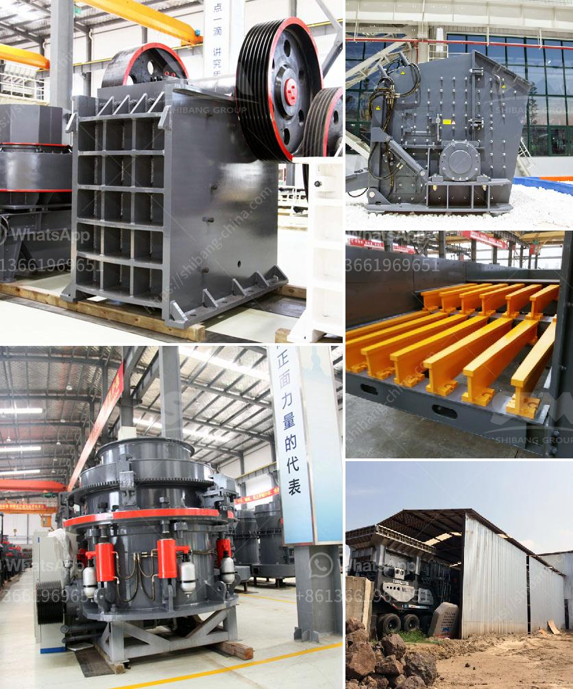

<h3>mobile crusher indonesia</h3>
With the growing demands of construction projects, the need for efficient and cost-effective machinery for crushing and screening has become crucial. One such solution that has caught the attention of contractors is the mobile crusher Indonesia, which allows contractors to easily crush and screen concrete, asphalt, bricks, aggregates, and other materials on-site.

A mobile crusher, also known as a mobile crushing station or mobile screening plant, offers multiple advantages over traditional stationary equipment. First, it saves transportation costs. Mobile crushers can be easily transported to different construction sites, eliminating the need for costly transportation of materials. This not only saves money but also reduces the carbon footprint associated with transportation.

Furthermore, a mobile crusher allows contractors to take advantage of the material available on-site. By crushing and reusing materials such as concrete and asphalt, contractors can save significant costs on material procurement. This environmentally friendly approach also reduces the need for mining and extraction of natural resources.

Indonesia, with its abundant natural resources and rapid urbanization, is no stranger to construction projects. In recent years, the demand for mobile crushers has been steadily increasing. According to data from the Indonesian Ministry of Public Works, the number of construction projects in Indonesia reached 267,913 in 2020, with a total value of IDR 3,377.5 trillion ($237.5 billion).

To meet this growing demand, several manufacturers have introduced their mobile crusher models in the Indonesian market. These crushers are equipped with advanced technology and features that make crushing and screening efficient and hassle-free.

For example, some mobile crushers have remote control capabilities, allowing operators to operate the machine from a safe distance. This feature is especially beneficial in hazardous environments or when dealing with unstable materials.

Another key feature of mobile crushers is their ability to be tailored to specific job requirements. Depending on the type of material and desired output size, contractors can choose from a variety of crusher models and configure them accordingly. This flexibility ensures maximum productivity and efficiency while minimizing downtime.

In addition to their versatility, mobile crushers are also known for their ease of maintenance. Manufacturers have designed these machines to be easily accessible for maintenance and repairs. This reduces downtime and keeps the crusher operating smoothly.

While there are numerous benefits to using a mobile crusher in Indonesia, it is important for contractors to select a reliable and reputable manufacturer. Considering factors such as durability, after-sales service, and availability of spare parts is crucial to ensure a long-lasting and efficient machine.

In conclusion, the mobile crusher Indonesia offers a cost-effective and environmentally friendly solution for crushing and screening challenges in construction projects. Its ability to be transported to different sites, its capability to crush and reuse materials on-site, and its adaptability to specific job requirements make it an attractive choice for contractors. By investing in a reliable mobile crusher, contractors can improve efficiency, save costs, and contribute to a more sustainable construction industry.
<h3>Contact us</h3><ul><li><strong>Whatsapp:&nbsp;<a href="https://wa.me/8613661969651">+8613661969651</a></strong></li><li><a href="https://swt.shibang-china.com/?git&amp;zhl&amp;mobile crusher indonesia"><strong>Online Service(chat now)</strong></a></li></ul><h3>Related</h3><ul><li><a href='small rock crusher for small scale aggregate producers.md'>small rock crusher for small scale aggregate producers</a></li><li><a href='malaysia grinder hammer mill manufacturer.md'>malaysia grinder hammer mill manufacturer</a></li><li><a href='cost000 tpd cement project ore processing.md'>cost000 tpd cement project ore processing</a></li><li><a href='stone crusher kapasitas 150m.md'>stone crusher kapasitas 150m</a></li><li><a href='screen and crusher hire.md'>screen and crusher hire</a></li></ul>