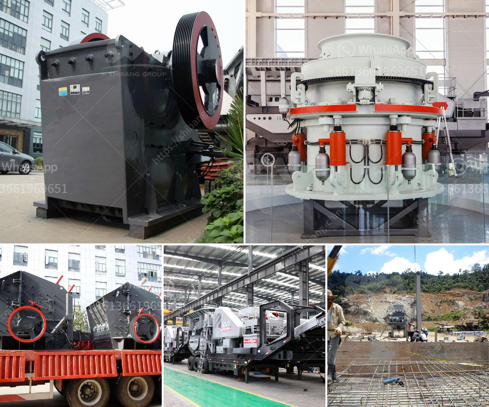

<h3>mobile crusher malaysia</h3>
Mobile Crusher Malaysia is an advanced crushing equipment that is developed and optimized by Shanghai SBM Machinery. It is mainly used for processing construction waste, mining, and various mineral ores. With the expanding of Malaysia's infrastructure construction projects, the demand for mobile crushing technology has increased sharply.

Mobile Crusher Malaysia is designed to crush various types of mineral ores into smaller pieces, such as limestone, marble, granite, basalt, river stone, etc. With the higher requirements of construction aggregates, Malaysia mining equipment industry has developed rapidly. For example, in 2019, the Malaysian government announced plans to invest RM130 billion ($31 billion) in infrastructure construction projects. This will further drive the demand for mobile crushers in Malaysia.

The mobile crushing equipment is flexible and can be relocated easily. This allows operators to change the working site as needed, which significantly reduces transportation costs. In addition, the mobile crusher Malaysia can work independently or in combination with other machines, allowing for a wider range of applications. It is ideal for crushing medium-hard and hard materials.

Mobile Crusher Malaysia has various control options, including hydraulic control, manual control, and electric control. The hydraulic control system allows remote control operation, making it easy and safe to operate. The manual control system allows operators to stop or start the machine manually when necessary. The electric control system is equipped with an intelligent PLC control system, which provides real-time monitoring of the machine's performance and reduces maintenance costs.

In conclusion, mobile crusher Malaysia is highly versatile and suitable for various crushing applications. It has excellent crushing performance and is easy to operate and maintain. Mobile Crusher Malaysia plays an important role in Malaysia's construction industry and mining industry. It is an indispensable equipment in modern crushing and screening industry.
<h3>Contact us</h3><ul><li><strong>Whatsapp:&nbsp;<a href="https://wa.me/8613661969651">+8613661969651</a></strong></li><li><a href="https://swt.shibang-china.com/?git&amp;zhl&amp;mobile crusher malaysia"><strong>Online Service(chat now)</strong></a></li></ul><h3>Related</h3><ul><li><a href='gravel crushers for sale in.md'>gravel crushers for sale in</a></li><li><a href='quartz plant machinery suppliers in china.md'>quartz plant machinery suppliers in china</a></li><li><a href='the crunch hand operated rock crusher.md'>the crunch hand operated rock crusher</a></li><li><a href='chinese mobile crusher.md'>chinese mobile crusher</a></li><li><a href='china top limestone crusher brands.md'>china top limestone crusher brands</a></li></ul>