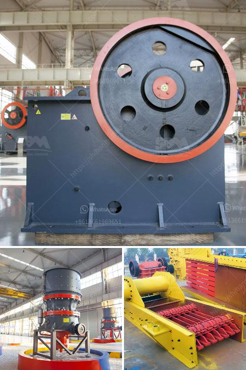

<h3>mobile crushers in mining</h3>
Mobile crushers are crucial in the mining industry for processing quarried materials into crushed stones or gravel. They are versatile and can be used in a variety of applications for various industries. Mobile crushers allow operators to move the crusher unit closer to the quarry and easily maneuver around obstacles or tight spaces.

One of the main advantages of mobile crushers is their flexibility. They can be operated in different locations as needed. This eliminates the need for transportation of materials, reducing costs and saving time. The ability to move the crusher unit closer to the quarry also reduces hauling distances, further reducing costs and environmental impacts.

Mobile crushers are designed to handle a variety of types of rock and ore, including granite, limestone, quartzite, and other mineral-rich materials. They offer efficient and reliable crushing processes, making them ideal for mining operations. The crushing process involves feeding the material into the crusher, breaking the rocks into smaller pieces, and then screening to separate the desired size fractions.

In addition to their mobility and versatility, mobile crushers offer several other benefits. They are equipped with advanced technology and automation systems, allowing for precise control of the crushing process. This results in consistent product quality and improved productivity. Furthermore, mobile crushers can be fitted with dust suppression systems to control dust emissions, promoting a cleaner and safer work environment.

Overall, mobile crushers play a crucial role in the mining industry by providing an efficient and reliable solution for processing quarried materials. Their flexibility and mobility allow operators to easily move the crusher unit to different locations, minimizing transportation costs. With advanced technology and automation, mobile crushers ensure consistent quality and productivity. As the mining industry continues to evolve, mobile crushers will remain essential equipment for efficient material processing.
<h3>Contact us</h3><ul><li><strong>Whatsapp:&nbsp;<a href="https://wa.me/8613661969651">+8613661969651</a></strong></li><li><a href="https://swt.shibang-china.com/?git&amp;zhl&amp;mobile crushers in mining"><strong>Online Service(chat now)</strong></a></li></ul><h3>Related</h3><ul><li><a href='types of coal crusher used in industry.md'>types of coal crusher used in industry</a></li><li><a href='price of tph stone crusher.md'>price of tph stone crusher</a></li><li><a href='quartz silica crushing unit.md'>quartz silica crushing unit</a></li><li><a href='fairly used stone crusher for sale nigeria.md'>fairly used stone crusher for sale nigeria</a></li><li><a href='calculations for belt conveyor structural bents.md'>calculations for belt conveyor structural bents</a></li></ul>