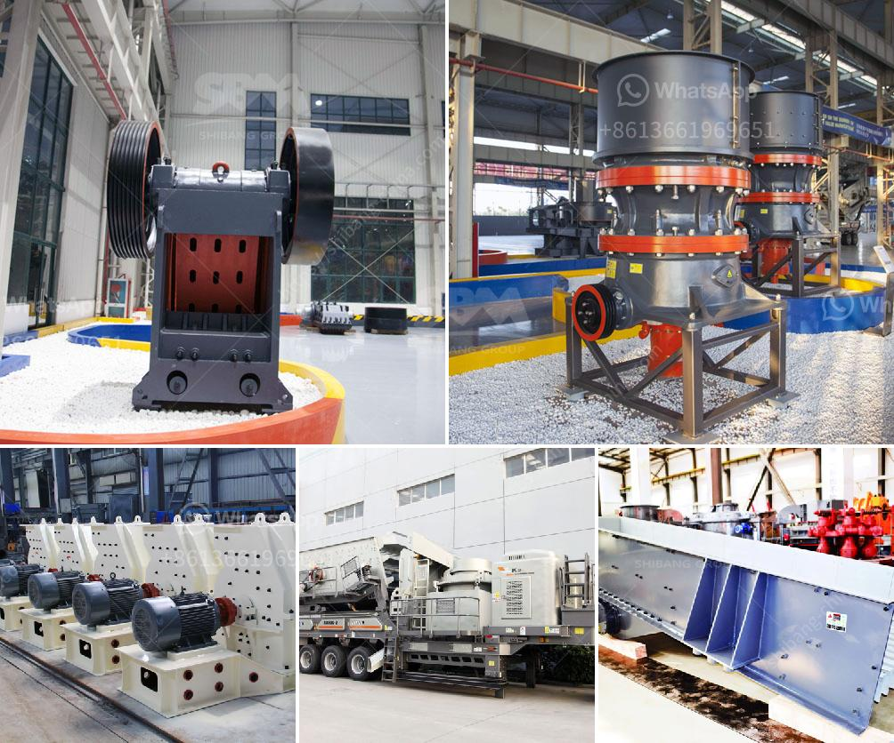

<h3>mobile crushers qatar</h3>
Mobile crushers have been increasingly popular in the past few years in Qatar. As the economy develops, the demand for crushers is increasing, providing lots of opportunities for mobile crushers suppliers in Qatar. The development of the infrastructure in Qatar has also witnessed a rapid growth in recent years. Qatar is on track to becoming a global player in various industries such as construction, infrastructure, and transportation. This growth is mainly driven by the government's focus on diversifying the economy and reducing the reliance on oil and gas.

Mobile crushers are versatile machines that are widely used in the mining, quarrying, and construction industry. Nowadays, mobile crushers for sale in Qatar come in various designs to meet the needs of different customers. The mobile crusher in Qatar can crush materials on site or transport them in a truck to crushers' final destination, where they can be used as road base or fill materials. Mobile Crusher is an innovation that has gained prominence in the last few years.

Qatar is now promising for the country-wide construction projects. Qatar highways, housing projects, tunnels, and ports are among the many megaprojects that have made headlines in recent years. The country is also preparing to host the FIFA World Cup in 2022. These projects require a massive amount of aggregate materials that can be produced by mobile crushers. Mobile crushers help contractors increase their profitability by crushing excess materials and selling them as aggregates for use in construction projects.

One of the advantages of mobile crushers is their flexibility. They can be easily transported from one site to another, allowing contractors to move their crushing operation wherever it is needed. This is particularly beneficial in Qatar, where construction sites are spread across various locations. Mobile crushers eliminate the need for additional equipment and manpower, reducing the overall cost of the project.

Another advantage of mobile crushers in Qatar is their capability to produce a wide range of aggregates sizes. Mobile crushers can produce several types of aggregates for different construction needs. For example, if the project requires a sub-base material, mobile crushers can produce various sizes of coarse aggregate materials for this purpose. On the other hand, if the project requires a fine aggregate material, mobile crushers can produce crushed stones of various sizes to meet the specific requirements.

Mobile crushers in Qatar also allow for on-site recycling, reducing overall construction waste. The recycling of construction materials not only helps protect the environment but also saves costs for contractors. Mobile crushers in Qatar can crush materials from demolished buildings and areas of renovation, recycling them for use in new construction or infrastructure projects.

In conclusion, mobile crushers in Qatar are highly sought-after machines in the construction industry. The growth in Qatar's infrastructure development projects provides significant opportunities for mobile crushers suppliers in the region. Their flexibility, ability to produce various aggregate sizes, and on-site recycling capabilities make mobile crushers an essential tool for contractors in Qatar. As the country continues to invest in its development, the demand for mobile crushers in Qatar is expected to increase further.
<h3>Contact us</h3><ul><li><strong>Whatsapp:&nbsp;<a href="https://wa.me/8613661969651">+8613661969651</a></strong></li><li><a href="https://swt.shibang-china.com/?git&amp;zhl&amp;mobile crushers qatar"><strong>Online Service(chat now)</strong></a></li></ul><h3>Related</h3><ul><li><a href='raymond mill in chennai.md'>raymond mill in chennai</a></li><li><a href='hammer mills kenya.md'>hammer mills kenya</a></li><li><a href='cost of cement manufacturing plant tons per day.md'>cost of cement manufacturing plant tons per day</a></li><li><a href='stone crushing for sale.md'>stone crushing for sale</a></li><li><a href='crawler type mobile crushers.md'>crawler type mobile crushers</a></li></ul>