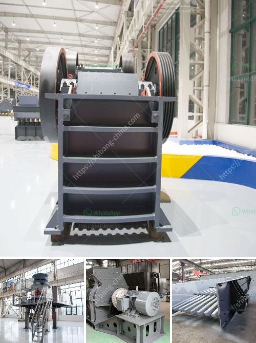

<h3>mobile crushing machine for sale</h3>
In today's fast-paced world, the need for mobility and flexibility is more important than ever. This holds true for industries such as construction, mining, and recycling, where the ability to move and process materials on-site is crucial for maximizing productivity. This is where mobile crushing machines come into play, providing a convenient and efficient solution for on-the-go crushing needs.

A mobile crushing machine, also known as a mobile crusher, is a versatile appliance that is designed to crush various types of materials, ranging from rocks, ore, and concrete debris, to asphalt, gravel, and sand. This machine can be used in a wide range of applications, including mining, quarrying, construction waste recycling, and more. 

One of the key advantages of a mobile crushing machine is its portability. Unlike traditional crushers, which are fixed in one location, mobile crushers can be easily transported to different worksites. This allows operators to bring the machine directly to where the materials are, eliminating the need for costly transportation and minimizing downtime.

Furthermore, mobile crushing machines are equipped with advanced features and technology that enhance their efficiency and performance. Many models offer adjustable settings, enabling operators to produce different sizes of crushed materials as per their specific requirements. Additionally, these machines are often equipped with powerful engines and hydraulic systems, allowing for quick and efficient crushing of various types of materials.

By investing in a mobile crushing machine, companies can benefit from increased productivity, reduced costs, and improved operational flexibility. Instead of relying on multiple machines or stationary crushers at different locations, a single mobile crusher can handle a wide range of crushing tasks, streamlining the entire process. This not only saves time but also reduces manpower and equipment expenses.

In conclusion, a mobile crushing machine for sale is a valuable investment for companies in industries such as construction, mining, and recycling. It offers a convenient and efficient solution for on-the-go crushing needs, allowing for increased productivity, reduced costs, and improved operational flexibility. With advanced features and technology, these machines are capable of crushing various types of materials quickly and efficiently, making them a must-have tool for any business seeking to optimize their crushing operations.
<h3>Contact us</h3><ul><li><strong>Whatsapp:&nbsp;<a href="https://wa.me/8613661969651">+8613661969651</a></strong></li><li><a href="https://swt.shibang-china.com/?git&amp;zhl&amp;mobile crushing machine for sale"><strong>Online Service(chat now)</strong></a></li></ul><h3>Related</h3><ul><li><a href='gypsum powder production plants.md'>gypsum powder production plants</a></li><li><a href='copper crusher supplier.md'>copper crusher supplier</a></li><li><a href='vibration screen machine.md'>vibration screen machine</a></li><li><a href='hammer mill for oregano.md'>hammer mill for oregano</a></li><li><a href='usinas de asfalto para venda em angola.md'>usinas de asfalto para venda em angola</a></li></ul>