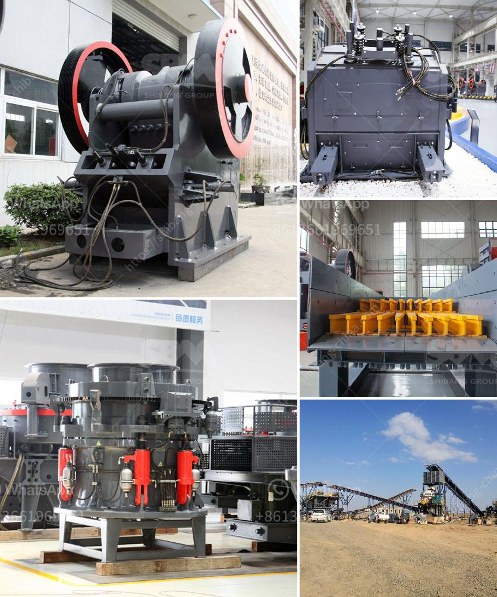

<h3>mobile dimension stone processing</h3>
In the construction industry, the use of natural stone as a building material is undeniably popular. Not only does it lend a sense of elegance and durability to structures, but it also adds timeless beauty to any project. However, the process of extracting and processing dimension stones can be quite cumbersome and time-consuming. Fortunately, with technological advancements, mobile dimension stone processing has emerged as a convenient solution that revolutionizes the construction industry.

Traditionally, obtaining dimension stones involved quarrying, which requires huge investments in terms of manpower and machinery. Quarrying demands large-scale operations, including building infrastructure to access the stone deposits, drilling, and blasting. Then, the stone blocks need to be cut and shaped into desired dimensions. All of these processes were carried out on-site, necessitating the use of heavy machinery, long transport distances, and extensive labor.

With the introduction of mobile dimension stone processing, the tedious and costly aspects of traditional practices have been reduced significantly. This innovative solution brings stone processing machinery directly to the quarries, eliminating the need for transportation to off-site facilities. As a result, time, cost, and energy are minimized, making this method more sustainable and efficient.

To achieve mobile dimension stone processing, sophisticated equipment and machinery are mounted on mobile platforms, allowing easy relocation between different quarry locations. These mobile processing units comprise cutting and shaping tools, such as wire saws, diamond saws, and hydraulic splitters, ensuring precision and quality. Additionally, advanced technological features enable real-time monitoring and adjustment, further enhancing the accuracy and speed of the processing.

One of the key advantages of mobile dimension stone processing is the ability to maximize the utilization of raw materials. Quarry sites often have different types of stone deposits that vary in quality, color, and texture. By bringing the processing equipment to the source, operators can extract the most suitable stones, utilizing the full potential of the site. This reduces waste and minimizes the environmental impact caused by unnecessary transportation and disposal.

Moreover, mobile dimension stone processing enables on-site quality control. Traditional practices often involved transporting raw stone blocks to separate processing facilities, resulting in the potential for damage or alteration during transit. With mobile processing, all stone blocks are cut, shaped, and finished right at the quarry site, ensuring the preservation of their natural characteristics and quality. This aspect is particularly important for high-value stones used in architectural projects or intricate designs that demand specific patterns and textures.

In conclusion, mobile dimension stone processing has become a game-changer in the construction industry. This innovative approach eliminates the need for labor-intensive and time-consuming transportation, reducing costs significantly. Moreover, it maximizes resource utilization and ensures on-site quality control, enabling the production of high-quality stone products. As mobile dimension stone processing continues to evolve and expand, it will continue to revolutionize the construction industry, providing a convenient and sustainable solution for the extraction and processing of natural stone.
<h3>Contact us</h3><ul><li><strong>Whatsapp:&nbsp;<a href="https://wa.me/8613661969651">+8613661969651</a></strong></li><li><a href="https://swt.shibang-china.com/?git&amp;zhl&amp;mobile dimension stone processing"><strong>Online Service(chat now)</strong></a></li></ul><h3>Related</h3><ul><li><a href='stone crusher kapasitas 150m.md'>stone crusher kapasitas 150m</a></li><li><a href='ton per hour gold wash plant.md'>ton per hour gold wash plant</a></li><li><a href='copper crusher supplier.md'>copper crusher supplier</a></li><li><a href='cone crusher manufacturers china.md'>cone crusher manufacturers china</a></li><li><a href='vertical vertical roller mill drives.md'>vertical vertical roller mill drives</a></li></ul>