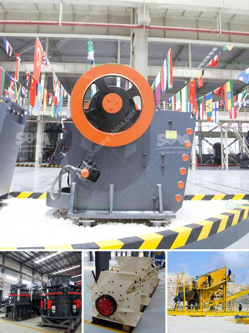

<h3>mobile gold processing plant with price</h3>
Gold mining industry is one of the significant contributors to the global economy and employs millions of workers worldwide. With advancements in technology, mining techniques have evolved to an extent where gold can be extracted from low-grade ores using a mobile gold processing plant. This versatile equipment has revolutionized the way gold is processed, making it more economical and environmentally friendly.

A mobile gold processing plant, also known as a mobile mineral processing plant, is an efficient and portable equipment for recovering gold from alluvial deposits and hard rock. They can be used for primary recovery or secondary recovery operations, depending on the ore characteristics and the desired output. The plant consists of various units such as crushers, screens, and concentrators, which work in tandem to extract gold from the ore.

The price of a mobile gold processing plant can vary depending on its capacity, technology, and customization options. Typically, a small-scale mobile plant with a capacity of 1-2 tons per hour can range from $20,000 to $50,000. On the other hand, larger plants with a capacity of 10-20 tons per hour can be priced anywhere between $100,000 to $500,000. These prices are only indicative and can vary based on the market demand, supplier, and location.

The cost-effectiveness of a mobile gold processing plant is one of its major advantages. Unlike traditional stationary plants, a mobile plant can be easily transported to the mining site, reducing transportation costs and time. Additionally, it eliminates the need for costly infrastructure and permits associated with building a stationary plant. As a result, small-scale miners and artisanal miners can now afford to process their ores economically.

Furthermore, a mobile gold processing plant is designed to minimize environmental impact. It utilizes water recycling systems, energy-efficient equipment, and specialized techniques to minimize water consumption, energy consumption, and waste generation. This not only reduces the carbon footprint but also ensures sustainable mining practices, making it a socially responsible choice for gold processing.

In terms of operational efficiency, a mobile plant has the advantage of mobility and flexibility. It can be easily relocated to different mining areas as the ore grades vary, ensuring continuous production. Moreover, it allows for quick on-site testing and optimization of processing parameters, providing real-time feedback to improve gold recovery rates. This adaptability makes a mobile gold processing plant ideal for challenging mining environments.

In conclusion, a mobile gold processing plant offers a cost-effective, environmentally friendly, and efficient solution for gold extraction. Its portability, flexibility, and low environmental impact make it an attractive choice for small-scale and artisanal miners. However, it is essential to consider various factors such as capacity, technology, and customization options when determining the price of a mobile gold processing plant.
<h3>Contact us</h3><ul><li><strong>Whatsapp:&nbsp;<a href="https://wa.me/8613661969651">+8613661969651</a></strong></li><li><a href="https://swt.shibang-china.com/?git&amp;zhl&amp;mobile gold processing plant with price"><strong>Online Service(chat now)</strong></a></li></ul><h3>Related</h3><ul><li><a href='crushing machine for ceramic raw materials.md'>crushing machine for ceramic raw materials</a></li><li><a href='slag crusher plant.md'>slag crusher plant</a></li><li><a href='brick making machines for sale in zimbabwe.md'>brick making machines for sale in zimbabwe</a></li><li><a href='cost of cement manufacturing plant tons per day.md'>cost of cement manufacturing plant tons per day</a></li><li><a href='mobile stone crusher for sale in philippines.md'>mobile stone crusher for sale in philippines</a></li></ul>