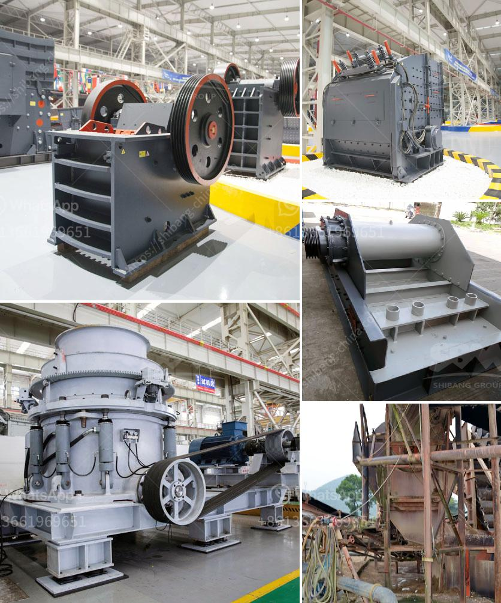

<h3>mobile iron ore crusher</h3>
The mining industry is growing at a rapid pace due to the demand for raw materials such as iron ore. With the rise in iron ore prices, many investors are looking for ways to capitalize on this opportunity. One way to do so is by investing in mobile iron ore crushers. These crushers are designed to break down the large rocks into smaller, more manageable pieces.

Mobile iron ore crushers are built with the latest technology to ensure maximum efficiency. The crusher plants are divided into several sections, each consists of different crushing capabilities. This mobility allows the equipment to easily reach the mining site, allowing for efficient and effective crushing operations.

One of the key advantages of mobile iron ore crushers is their flexibility. With various models and sizes available, these crushers can be utilized in different industries and applications. They can be used in mining, quarrying, recycling, demolition, and even forestry operations. The mobility of these crushers allows for on-site crushing, reducing the need for transporting the materials to a fixed crushing plant.

Another advantage of mobile iron ore crushers is their compact design. These machines are usually mounted on tracks, which makes them easy to maneuver in different terrains. They can be transported from one site to another without the need for disassembly or reassembly. This flexibility and compactness make them suitable for remote and hard-to-reach locations.

Mobile iron ore crushers are also equipped with various safety features to ensure the protection of operators and equipment. These features may include emergency stop buttons, remote control operation, and safety guards. Additionally, the crushers are designed to withstand harsh environmental conditions, such as extreme temperatures and high moisture levels.

The efficiency of mobile iron ore crushers is another key advantage. These machines can process large quantities of ore in a short period, increasing the productivity of mining operations. The advanced crushing technology used in these crushers helps to reduce the generation of fines, resulting in higher product quality.

Moreover, mobile iron ore crushers are cost-effective, as they eliminate the need for transportation and reduce operational expenses. Instead of transporting the ore to a fixed crushing plant, the crushers can be brought directly to the mining site. This saves time, fuel, and money.

In conclusion, mobile iron ore crushers are a valuable investment for any mining company. With their flexibility, compact design, and advanced technology, these crushers offer numerous advantages. They can be used in various industries and applications, providing efficient and effective crushing operations. Additionally, they are equipped with safety features and are cost-effective. Investing in mobile iron ore crushers can help mining companies capitalize on the growing demand for iron ore and increase their profitability.
<h3>Contact us</h3><ul><li><strong>Whatsapp:&nbsp;<a href="https://wa.me/8613661969651">+8613661969651</a></strong></li><li><a href="https://swt.shibang-china.com/?git&amp;zhl&amp;mobile iron ore crusher"><strong>Online Service(chat now)</strong></a></li></ul><h3>Related</h3><ul><li><a href='mobile crusher for sale in south africa.md'>mobile crusher for sale in south africa</a></li><li><a href='hard stone crush maker pakistan.md'>hard stone crush maker pakistan</a></li><li><a href='mobile crushers qatar.md'>mobile crushers qatar</a></li><li><a href='hammer mill crusher price.md'>hammer mill crusher price</a></li><li><a href='mining crusher equipment south africa.md'>mining crusher equipment south africa</a></li></ul>