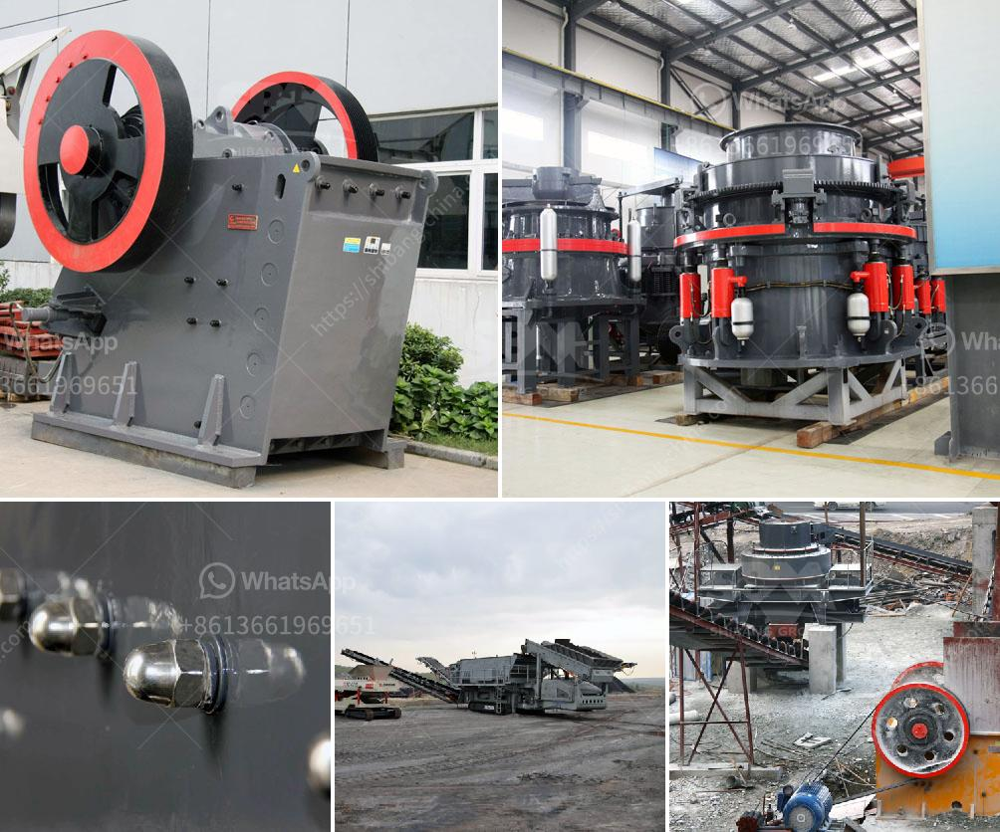

<h3>mobile iron ore impact crusher suppliers in india</h3>
India is rich with iron ore resources. Iron ore mining industry develops rapidly in this country. In India, most of the iron ore is found in the Deccan Plateau which is a large geological formation extending over a vast area of the southern part of India. From the coast on the Bay of Bengal, the Eastern Ghats merge with the Vindhya and Satpura ranges in central India. The Deccan Plateau is a large plateau in India, making up most of the southern part of the country. Its diverse geological features include hills, plains, river basins, lakes, and coastal areas. This region is a major source of iron ore in India.

Mobile impact crushers are specially designed to crush softer and less abrasive materials like limestone and weathered rocks into high-quality aggregates. These crushers are used for crushing medium-hard and hard materials in the mining, cement, coal, metallurgy, building materials, road construction, and chemical industries.

Mobile iron ore impact crusher suppliers in India are located in different states. Some of the major iron ore producing states are Odisha, Jharkhand, Chhattisgarh, Andhra Pradesh, Karnataka, Goa, and Maharashtra. The major cities that are involved in iron ore mining in India include Barbil, Jamshedpur, Durgapur, Rourkela, Raipur, Hospet, and Bellary.

Mobile iron ore impact crusher suppliers in India have a wide range of applications, such as crushing iron ore on a mine site for further processing into steel, processing iron ore for blast furnaces, and creating high-quality iron ore products. The mobile impact crushers are also used for crushing coal, limestone, granite, basalt, andesite, river stone, pebble, lead-zinc ore, copper ore, manganese ore, etc.

Mobile iron ore impact crusher suppliers in India have been widely used for crushing and screening various ores in India for over a decade. With significant growth in the steel industry, it has become necessary to look for alternate sources of iron ore. This has led to a flourishing iron ore mining industry in India and the demand for mobile crushers has increased significantly.

The mobile iron ore impact crushers supplied by Indian suppliers are capable of handling any size of iron ore, reducing the initial size of the ore to a smaller size, and processing it into high-quality aggregates. These mobile crushers have been successfully operating in various iron ore mines across India.

In conclusion, mobile iron ore impact crusher suppliers in India have a wealth of experience in the field of iron ore mining and processing technology. With their industry-leading expertise, these suppliers are able to offer crushing solutions that are reliable, durable, and highly efficient. They provide a cost-effective method of reducing and processing iron ore, which is essential in the steel industry. The mobile impact crushers are versatile, easy to use, and highly productive, making them a valuable tool for iron ore mining and processing operations in India.
<h3>Contact us</h3><ul><li><strong>Whatsapp:&nbsp;<a href="https://wa.me/8613661969651">+8613661969651</a></strong></li><li><a href="https://swt.shibang-china.com/?git&amp;zhl&amp;mobile iron ore impact crusher suppliers in india"><strong>Online Service(chat now)</strong></a></li></ul><h3>Related</h3><ul><li><a href='jaw crusher sale uk.md'>jaw crusher sale uk</a></li><li><a href='impact crusher for iron ore.md'>impact crusher for iron ore</a></li><li><a href='china raymond roller mills.md'>china raymond roller mills</a></li><li><a href='granite crusher machine philippines.md'>granite crusher machine philippines</a></li><li><a href='part of ball mill.md'>part of ball mill</a></li></ul>