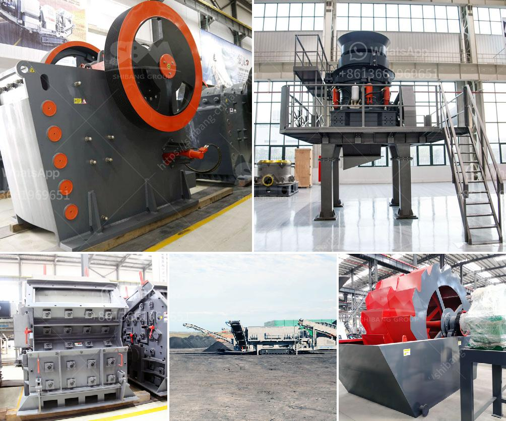

<h3>mobile limestone crusher for sale indonessia</h3>
Mobile limestone crusher is a special type of mobile crusher which can be used in limestone crushing process. Limestone is a sedimentary rock composed mainly of calcium carbonate (CaCO3), usually calcite. In the cement plant, limestone is the major raw material for cement production. Go through crushing, grinding process, and then make in the dust. Limestone comes in large pieces from the quarry to the factory and therefore must be crushed to reduce and homogenize the grain size.

To effect the grinding of the most important raw material for the process in terms of quantity, arose the following alternatives:

The practice proved that the effect is very significant when the "big gold tooth" alloy hammer crusher crushing limestone, especially the high silicon content of limestone, it has hitted a record that a hammerhead used for 18 month long, has crushed 3.2 million tons material in Jiangxi Yadong Cement, it is well-deserved star hammer.

Mobile limestone crusher is the main limestone mobile crusher for sale with low price by the manufacturer. Limestone is widely used in industries like steel metallurgy, paper making, rubber, plastic, fodder, tooth paste and make up and is one of the most important industry raw materials. SBM design the high performance limestone crushing plant for limestone crushing solution. In limestone crushing plant, jaw crusher is used as the primary crusher, when big limestone are crushed smaller by jaw crusher, they are transferred to impact crusher or cone crusher for secondary crushing.

With the improvement of technology, mobile limestone crushers have been developed and produced. Mobile limestone crushers are a special type of mobile crushers which are generally preferred for crushing limestone. The biggest advantage of the mobile limestone crushers is that they are used for various purposes and they are secure. Mobile limestone crushers manufacturers generally manufacture mobile crusher according to the quality of the raw materials they need.

In addition, mobile limestone crushers have many advantages like environmental protection, daily operation and investment budget, saving, etc. It is mainly used in infrastructure, which greatly reduces the cost of transportation, saves energy and resources. In conclusion, the mobile limestone crusher for sale indonessia has a wide range of applications in various industries and is durable in use. It is the ideal equipment for crushing limestone.
<h3>Contact us</h3><ul><li><strong>Whatsapp:&nbsp;<a href="https://wa.me/8613661969651">+8613661969651</a></strong></li><li><a href="https://swt.shibang-china.com/?git&amp;zhl&amp;mobile limestone crusher for sale indonessia"><strong>Online Service(chat now)</strong></a></li></ul><h3>Related</h3><ul><li><a href='lafarge evander quartz crushers.md'>lafarge evander quartz crushers</a></li><li><a href='6inch rock crushing mill in guatemala.md'>6inch rock crushing mill in guatemala</a></li><li><a href='crusher plant dolomite.md'>crusher plant dolomite</a></li><li><a href='distributor crusher di indonesia.md'>distributor crusher di indonesia</a></li><li><a href='crusher stone crusher 10x 21 america.md'>crusher stone crusher 10x 21 america</a></li></ul>