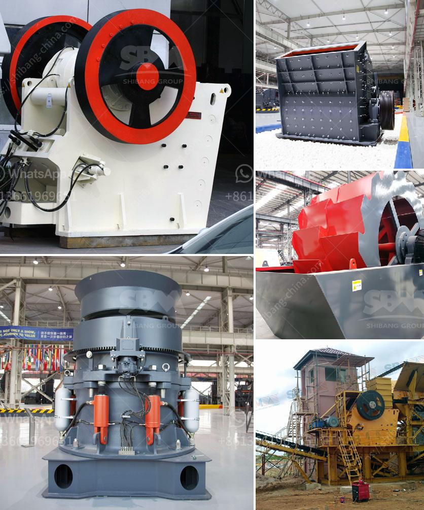

<h3>mobile screen crusher for sale south africa</h3>
Mobile screen crusher is a device that is essentially used to help crush rocks and ores of different hardness levels. The device works by breaking the material into smaller pieces, which makes it easier for the user to transport and store. In addition, it also helps enhance the efficiency of other types of crushers, as it pre-screens the material before it goes through the actual crushing process.

One of the most popular mobile screen crushers for sale in South Africa is the Rubble Master. This highly efficient and versatile machine can handle a wide variety of materials, including concrete, brick, asphalt, and natural rock. It comes equipped with a powerful and fuel-efficient diesel engine, making it ideal for use in remote locations where electricity may not be readily available.

The Rubble Master mobile screen crusher is also equipped with a high-performance screening plant that enables efficient separation of various material fractions. This can be particularly useful in recycling applications, where the goal is to re-use construction materials as much as possible. By screening the crushed materials, unwanted particles can be removed, ensuring that the resulting product is of high quality and suitable for reuse.

Furthermore, the Rubble Master mobile screen crusher can be easily transported and set up on-site, making it a cost-effective solution for various crushing and screening applications. Its compact size and maneuverability allow it to navigate through narrow spaces, making it suitable for use in urban areas as well.

With a wide range of applications and superior performance, the Rubble Master mobile screen crusher is an excellent investment for businesses in South Africa. Its ability to enhance the efficiency of the crushing process and produce high-quality materials makes it a valuable asset in construction, mining, and recycling industries. Whether you need to process concrete, asphalt, or natural rock, this mobile screen crusher is a reliable and efficient solution that can help your business thrive.
<h3>Contact us</h3><ul><li><strong>Whatsapp:&nbsp;<a href="https://wa.me/8613661969651">+8613661969651</a></strong></li><li><a href="https://swt.shibang-china.com/?git&amp;zhl&amp;mobile screen crusher for sale south africa"><strong>Online Service(chat now)</strong></a></li></ul><h3>Related</h3><ul><li><a href='manufacture of hammer mill.md'>manufacture of hammer mill</a></li><li><a href='used ball mill machine capacity in indonesia.md'>used ball mill machine capacity in indonesia</a></li><li><a href='jaw crusher 24x36.md'>jaw crusher 24x36</a></li><li><a href='used jaw crusher for sale.md'>used jaw crusher for sale</a></li><li><a href='machine de lavage a lattrition du sable de silice.md'>machine de lavage a lattrition du sable de silice</a></li></ul>