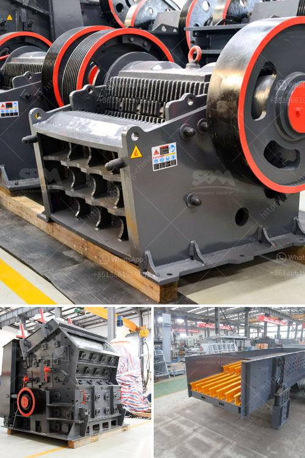

<h3>mobile stone crusher available for hire</h3>
Mobile stone crusher is a machine that has all the features of a stationary machine but is specifically designed to be mobile. This machine is usually equipped with wheel or track units so that it can move and be transported easily. The mobile stone crusher comes with a variety of types and specifications, and it can crush various materials, such as granite, marble, basalt, limestone, quartz, river pebbles, etc.

One of the key benefits of mobile stone crusher is its versatility. This machine can adapt to a wide range of crushing applications and can be used in various industries, such as mining, quarrying, construction, recycling, and demolition. It can crush different sizes of materials, from small particles to larger chunks, making it suitable for both coarse and fine crushing.

Another advantage of mobile stone crusher is its convenience. With a mobile unit, there is no need for extensive foundation work, which can save time, labor, and cost. This machine can be quickly set up and ready to use in a short period of time. It also eliminates the need for transportation of the materials to a centralized location, as the crusher can be moved closer to the source of the materials. This can significantly reduce transportation costs and mitigate environmental impacts.

Mobile stone crusher available for hire is ideal for crushing on construction sites and for contractors who require mobility with their equipment. It can be easily moved around the site, and can crush materials on-site, saving both time and money. The machine also has a compact design and can be easily transported and maneuvered on narrow and tight job sites.

The mobile stone crusher is operated by a fully trained and experienced operator who ensures that the machine operates safely and efficiently. The operator also helps with the setup and maintenance of the machine, and can provide guidance on how to maximize its performance and productivity.

The mobile stone crusher is available for hire in various sizes and capacities, ranging from 80 to 500 tons per hour. The machine is equipped with advanced technology and features, such as a hydraulically adjustable jaw, remote control, and wireless remote monitoring system, to ensure its high efficiency and reliability.

In conclusion, the mobile stone crusher is a machine that can crush a variety of materials, is versatile, convenient to use, and is ideal for on-site crushing by contractors. It offers a cost-effective solution for reducing construction waste and increasing resource utilization. With its mobility and flexibility, it can adapt to different job sites and applications, providing efficient and reliable crushing services.
<h3>Contact us</h3><ul><li><strong>Whatsapp:&nbsp;<a href="https://wa.me/8613661969651">+8613661969651</a></strong></li><li><a href="https://swt.shibang-china.com/?git&amp;zhl&amp;mobile stone crusher available for hire"><strong>Online Service(chat now)</strong></a></li></ul><h3>Related</h3><ul><li><a href='coal mining equipment for sale.md'>coal mining equipment for sale</a></li><li><a href='medium sized stone crusher for sale.md'>medium sized stone crusher for sale</a></li><li><a href='how to start stone crushing business in kenya.md'>how to start stone crushing business in kenya</a></li><li><a href='used primary crushers for sale.md'>used primary crushers for sale</a></li><li><a href='gypsum crusher plants in pakistan.md'>gypsum crusher plants in pakistan</a></li></ul>