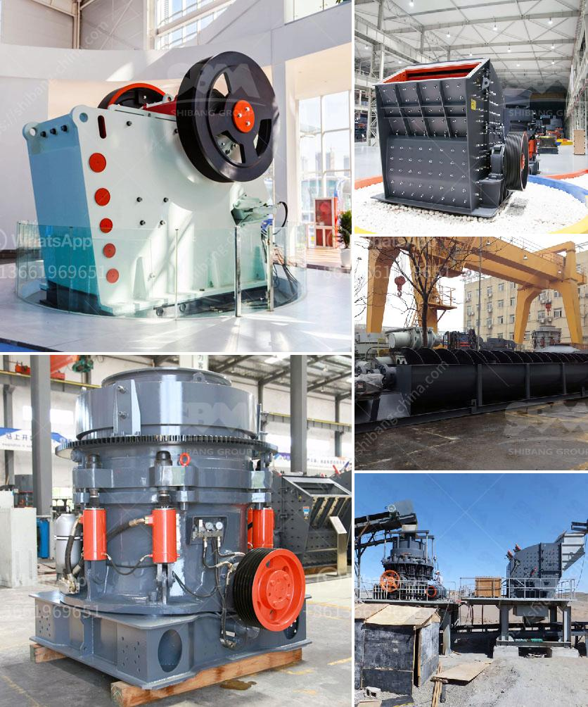

<h3>mobile stone crusher for sale in philippines</h3>
Mobile stone crusher is also called as portable stone crusher. It is widely used in mining industry, construction waste processing, road and railway construction, building construction, etc. It is usually used to crush stones of medium and high hardness. Different types of mobile stone crusher in Philippines have different production capacity. The following introduces them in detail.

1. Jaw crusher: Jaw crusher is the most common type of crusher equipment. It is widely used in mining, smelting, building materials, highway, railway, water conservancy, chemical industry and so on. Its compressive strength is less than 320 MPa. The jaw crusher is of the curved dynamic extrusion type, and the materials are crushed in the crushing cavity composed of the moving jaw and the fixed jaw. The hammer crusher is mainly broken by the impact, shear and tear of the rotating hammer head, the mutual impact between materials and the counterattack of the lining plate.

2. Impact crusher: Impact crusher is a commonly used crusher in the mining industry. It has a wide range of applications, such as construction, metallurgy, highway and railway construction, chemical industry, etc. It can crush limestone, slag, coke, coal and other materials. Impact crusher has the advantages of large crushing ratio, high crushing efficiency, low power consumption, uniform product size and selective crushing effect. It is a promising crushing equipment.

3. Cone crusher: Cone crusher is suitable for crushing various ores and rocks with medium hardness and above. It has the characteristics of reliable structure, high production efficiency, convenient adjustment, and economical use. It is widely used in metallurgy, construction, road construction, chemical industry, and the phosphate industry. It is suitable for crushing hard and medium-hard ores and rocks.

The mobile stone crusher for sale in Philippines is widely used in metallurgy, chemical industry, construction waste recycling and other industries. It is widely used in the crushing of medium-hard and hard materials, such as cement, silicate products, new building materials, refractory materials, fertilizers, black and non-ferrous metal ores, as well as glass, ceramics and other production industries.

Mobile stone crusher for sale in Philippines is very convenient and flexible because of its mobile nature. It can be easily moved from one location to another, which makes it an energy-saving machine. The launch of the mobile crusher eliminates the complex steel structure and the foundation construction. It can be driven directly to the site, without the need to transport materials, which saves time and transportation costs. In addition, the mobile crusher is composed of a vehicle-mounted crushing device and a vehicle electrical control cabinet. It is simple and easy to operate, with convenient maintenance and repair features.

In conclusion, the mobile stone crusher for sale in Philippines is suitable for crushing medium-hard and hard materials. It is widely used in metallurgy, construction, road construction, chemical industry and phosphate industry. With the advantages of large crushing ratio, high production efficiency, stable operation and convenient maintenance, the mobile stone crusher for sale in Philippines is an ideal equipment for secondary and tertiary crushing.
<h3>Contact us</h3><ul><li><strong>Whatsapp:&nbsp;<a href="https://wa.me/8613661969651">+8613661969651</a></strong></li><li><a href="https://swt.shibang-china.com/?git&amp;zhl&amp;mobile stone crusher for sale in philippines"><strong>Online Service(chat now)</strong></a></li></ul><h3>Related</h3><ul><li><a href='used ball mill machine capacity in indonesia.md'>used ball mill machine capacity in indonesia</a></li><li><a href='wet process feldspar supplier.md'>wet process feldspar supplier</a></li><li><a href='crusher mill for china price.md'>crusher mill for china price</a></li><li><a href='companies rent vibrating screens.md'>companies rent vibrating screens</a></li><li><a href='crushers double toggle.md'>crushers double toggle</a></li></ul>