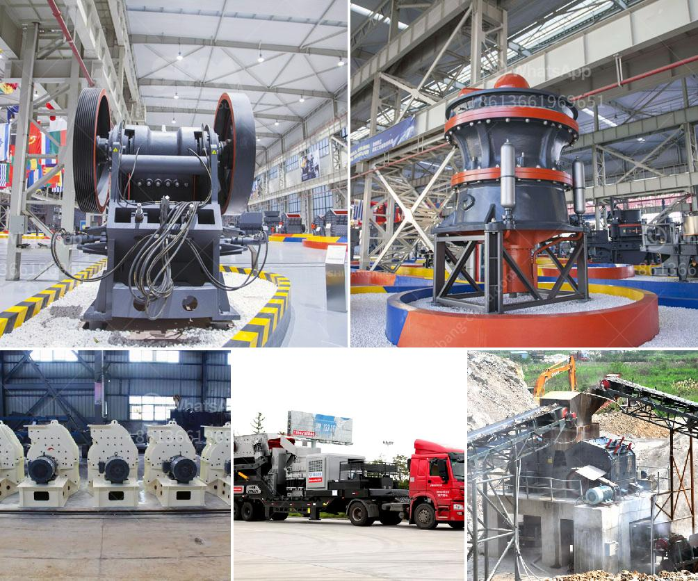

<h3>mtm 160 trapezium mill shanghai</h3>
Shanghai is widely recognized as a major global city and a hub for industries. As a result, the city has witnessed tremendous growth in various sectors, including manufacturing, construction, and mining. One of the critical industries in Shanghai is the production of industrial milling equipment. Within this realm, the MTM 160 Trapezium Mill has emerged as a leading product manufactured by Shanghai Shibang Machinery Co., Ltd.

The MTM 160 Trapezium Mill is a medium-speed trapezium mill designed for industrial production lines. It combines the best qualities of the traditional Raymond mill, along with unique features of modern technology. This mill is highly efficient and robust, making it suitable for various applications in different industries, including mining, metallurgy, and chemical engineering.

At the core of the MTM 160 Trapezium Mill lies its grinding rollers and grinding rings. These components are made of high-quality materials that ensure durability and long service life. The mill's rollers are equipped with wear-resistant and corrosion-resistant materials, which allows for efficient grinding of materials without compromising on the quality of the final product. Moreover, the grinding rings are designed with multiple layers, ensuring a smooth and even grinding process.

One of the standout features of the MTM 160 Trapezium Mill is its efficient dust removal system. The advanced dust removal equipment equipped in the mill prevents the dispersion of dust particles, ensuring a cleaner and healthier working environment. This feature not only benefits the workers but also reduces the environmental impact of the milling process.

Another significant advantage of the MTM 160 Trapezium Mill is its high production capacity. The mill's advanced technology and the optimized design of its grinding chamber allow for an increased throughput of materials. This leads to higher productivity and cost-effectiveness for the industries that rely on this mill for their operations.

Furthermore, the MTM 160 Trapezium Mill offers a wide range of adjustable fineness options, enabling industries to produce materials with different particle sizes. Whether it is fine powder or coarse particles, this mill can meet the diverse needs of various applications. The flexibility in particle size control makes it a popular choice for industries requiring precision in their final products.

To ensure customer satisfaction, Shanghai Shibang Machinery Co., Ltd provides comprehensive after-sales services for the MTM 160 Trapezium Mill. The company has established a global service network, ensuring timely technical support and efficient spare parts supply. This allows customers to minimize downtime and maximize the productive life of their mill.

In conclusion, the MTM 160 Trapezium Mill from Shanghai Shibang Machinery Co., Ltd is a highly efficient and reliable industrial milling equipment. Its durable design, efficient dust removal system, high production capacity, and adjustable fineness options make it a valuable asset for industries in Shanghai and beyond. As the city continues to thrive as an industrial hub, the demand for advanced milling equipment like the MTM 160 Trapezium Mill is expected to rise and contribute to the growth of various sectors.
<h3>Contact us</h3><ul><li><strong>Whatsapp:&nbsp;<a href="https://wa.me/8613661969651">+8613661969651</a></strong></li><li><a href="https://swt.shibang-china.com/?git&amp;zhl&amp;mtm 160 trapezium mill shanghai"><strong>Online Service(chat now)</strong></a></li></ul><h3>Related</h3><ul><li><a href='complete stone crushing 300 tph plant.md'>complete stone crushing 300 tph plant</a></li><li><a href='big crushing machine.md'>big crushing machine</a></li><li><a href='jaw crusher 200 tonnes per hour.md'>jaw crusher 200 tonnes per hour</a></li><li><a href='gravel crusher machine philippines.md'>gravel crusher machine philippines</a></li><li><a href='price stone crusher.md'>price stone crusher</a></li></ul>